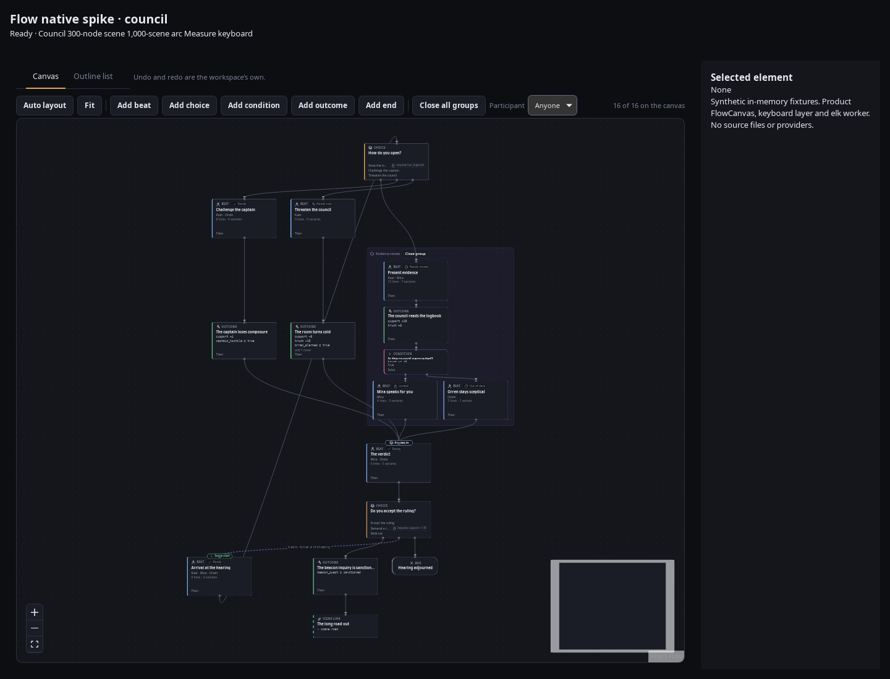

# 17 — Flow canvas spike: React Flow, elkjs, and the node vocabulary

[151](https://github.com/krazyjakee/wobu/issues/151) asks for a Flow view that stays usable on a
real story before anybody writes one. This is the note that closes that gap
([#184](https://github.com/krazyjakee/wobu/issues/184)). It is a record of what was **installed,
built and run on this machine**, not a survey of what the libraries claim.

> ✅ **Verified by installing, building and running, 2026-09-07.** Every number below came out of
> `@xyflow/react` 12.11.6, `elkjs` 0.12.0, `@dagrejs/dagre` 3.1.1 and `dagre` 0.8.5 installed into
> this repo, built with the repo's own Vite 7 and measured with the repo's own Vitest 3 and Node
> 22.22.0 on Linux. Claims that could not be tested here are marked 🚩 and say why. The section
> [What this spike did not test](#what-this-spike-did-not-test) is not a formality; read it before
> quoting a number.

**The prototype is gone, on purpose.** It was a throwaway `spike/` directory with its own Vitest
config, deleted once the numbers were recorded. The issue's own verification says the prototype is
not merged into the product, and a half-built canvas sitting in `src/` waiting for
[#186](https://github.com/krazyjakee/wobu/issues/186) is exactly the thing that rots.

---

## The decisions

| | Choice | Version measured |
| --- | --- | --- |
| Canvas | **`@xyflow/react`** (React Flow) | **12.11.6**, MIT |
| Layout | **`elkjs`**, `elk.layered`, in a Web Worker | **0.12.0**, EPL-2.0 OR GPL-3.0-or-later |
| Rejected | `@dagrejs/dagre` 3.1.1 (MIT), `dagre` 0.8.5 (MIT) | — |
| Fallback if React Flow fails in the webview | hand-rolled SVG canvas — no second library is close | — |

**Neither is installed in `package.json` today.** `knip` fails on a dependency nothing imports, and
[14](14-code-health.md) says plainly that there are no ignore globs in the Knip configuration and
that an unused package still fails. Inventing an exception so a spike can leave its dependencies
lying around is a worse precedent than one extra command. #186 starts with:

```sh
npm install @xyflow/react@12.11.6 elkjs@0.12.0
npm run licences        # elkjs must reappear in the review list; see Licences below
```

---

## The canvas: React Flow 12.11.6

### What was verified

Everything in this list was asserted by a test that ran, not read off a changelog.

- **React 19.1 with `StrictMode`.** Custom node types, `Handle` ports, edges, `useNodesState` /
  `useEdgesState`, `useReactFlow`, `Background` and `MiniMap` all render and behave under the
  double-invoked render. No warning, no `act` complaint, no effect-cleanup fallout.
- **Vite 7.3.6.** Four production builds, including one that puts elkjs in a Web Worker. No
  plugin, no alias, no `optimizeDeps` entry, no CommonJS interop escape hatch.
- **TypeScript.** The prototype type-checked clean under this repo's own `tsconfig.json` — `strict`,
  `noUncheckedIndexedAccess`, `noUnusedLocals`, `verbatimModuleSyntax`. The generic parameters that
  matter (`Node<Data, 'beat'>`, `NodeProps<BeatNode>`, `useReactFlow<BeatNode, Edge>`) all carry
  data types through to the custom component and back out of the imperative API. This is a
  first-class TypeScript library, not a `.d.ts` bolted onto JavaScript.
- **Licence.** `node_modules/@xyflow/react/LICENSE` is the MIT text, "Copyright (c) 2019-2025
  webkid GmbH". Its own dependencies — `@xyflow/system` 0.0.82, `classcat`, the `d3-*` family — are
  MIT or ISC. The README asks organisations making money from it to sponsor; that is a request in a
  README, not a term in the licence. Nothing in the distributed graph moves off `permissive`.

### The one dependency surprise

React Flow 12 depends on `zustand@^4.4.0`. Wobu is on 5. npm therefore nests a **second zustand,
4.5.7, inside `node_modules/@xyflow/react/`**, and both end up in the bundle.

Forcing one copy works, and is still the wrong thing to do. With `"overrides": { "zustand": "^5.0.2" }`
the nested copy disappears, React Flow runs on zustand 5.0.15, and all twelve prototype tests still
pass — but mounting 1,000 nodes went from 7.1–7.9 s to 13.0–13.4 s across two runs each, and 300
nodes from 1.51 s to 1.92 s. **Accept the duplicate.** It is a few kilobytes; the override is a
measured regression against a version the library does not claim to support.

### Bundle cost

Vite 7.3.6, `esbuild` minify, `gzip -9`, measured on the emitted asset files.

| Bundle | JS raw | JS gzip | CSS raw | CSS gzip |
| --- | ---: | ---: | ---: | ---: |
| React 19 + ReactDOM only | 193,244 | 60,339 | 0 | 0 |
| \+ `@xyflow/react` | 375,400 | 119,393 | 15,869 | 2,656 |
| \+ `@dagrejs/dagre` | 423,680 | 136,312 | 15,869 | 2,656 |
| \+ `elkjs`, imported on the main thread | 1,832,587 | 560,345 | 15,869 | 2,656 |
| \+ `elkjs`, in a Web Worker | 380,046 main | 121,790 main | 15,869 | 2,656 |

So: React Flow costs **+59 KB gzipped JS and +2.6 KB gzipped CSS**. dagre costs **+17 KB gzipped**.
elkjs on the main thread costs **+431 KB gzipped** — twenty-six times dagre — and in a worker costs
**+2 KB gzipped on the main chunk** plus a separate 1,433,538-byte worker asset that Vite emits as
its own file and the app never parses until it starts the worker.

### Accessibility: what the library gives, and what it does not

Asserted against the rendered DOM:

| | |
| --- | --- |
| Every node | `tabindex="0"`, `role="group"`, `aria-roledescription="node"`, `aria-label`, `aria-describedby` pointing at a live instructions region |
| Every edge | `tabindex="0"`, `role="group"`, `aria-roledescription="edge"`, a generated `aria-label` ("Edge from n0 to n1") |
| Enter / Space on a focused node | selects it |
| Arrow keys on a *selected* node | move the node's position |
| `deleteKeyCode` | deletes the selection |
| **Handles (ports)** | **no `tabindex`, no `role`, no key handler** |

That last row is the gap. React Flow's `connectOnClick` lets a pointer click one handle and then
another; there is no keyboard equivalent, because handles are not focusable. And the arrow keys
*move* a node rather than *navigate* to its neighbours, so `Tab` order is node-array order, which
has nothing to do with the story.

**Both gaps close in about 55 non-blank lines**, written against the public API only — no forked
component, no store internals. The prototype hook did graph-aware traversal (`ArrowDown` to the
first successor, `ArrowUp` to the predecessor, `ArrowLeft`/`ArrowRight` between siblings of a shared
parent), keyboard connection (press a key on the source node, then on the target), and delete with
focus moved on to a surviving node. Four tests assert it: traversal follows edges rather than DOM
order, focus moves with selection so a screen reader follows, two nodes connect with no pointer at
all, and deleting a node takes its edges with it.

One thing that hook taught us and #186 should not rediscover: **the half-made connection cannot live
in a ref inside the hook.** The hook runs once per node component, so every node would get its own
and the second keypress would never see the first. It belongs on the Flow slice of the zustand
store, beside the selection.

[151](https://github.com/krazyjakee/wobu/issues/151) already requires an outline list mode that
offers every Flow operation, so the canvas does not have to carry the whole burden. It does have to not be a mouse-only dead end, and
with those 55 lines it is not.

---

## The layout engine: elkjs over dagre

React Flow ships no automatic layout at all, so this is a separate decision with its own answer.

Both engines were run on the same four fixtures through the same adapter shape and the same metric
code. The fixtures are synthetic and built from the issue's description: the **council** graph is
three approach branches (evidence, threaten, appeal) reconverging on one verdict, with a nested
"Evidence review" subgraph inside the evidence branch and a long back edge from the verdict choice
all the way up to the arrival beat. The **scene** graph is 304 nodes of the same shape repeated. The
**arc** graph is 1,000 scene-link nodes in 50 quest groups; **arc collapsed** is that graph with 80%
of its quests collapsed to a single box, which is what the canvas would actually draw.

### Timing and quality

Median of seven runs, main thread, Node 22.22.0. "Crossings" counts intersections of straight
centre-to-centre segments — not what either engine routes, but the same approximation for both.
"Skew" is how far a node with three or more inbound edges sits from the mean x of its predecessors,
in pixels: **lower is a better-centred reconvergence**, which is the thing the issue asks about.

| Graph | Nodes / edges | Engine | Median ms | Crossings | Skew px | Extent w × h |
| --- | --- | --- | ---: | ---: | ---: | --- |
| council | 22 / 23 | dagre | **9.6** | 1 | **2** | 1085 × 1498 |
| council | 22 / 23 | elk | 18.7 | **0** | 5 | 997 × **1478** |
| scene | 304 / 353 | dagre | **112.2** | 37 | 216 | **3870** × 10544 |
| scene | 304 / 353 | elk | 167.7 | **18** | **110** | 4440 × **10480** |
| arc | 1000 / 1147 | dagre | 3384.5 | **272** | — | **2590** × 66934 |
| arc | 1000 / 1147 | elk | **619.4** | 337 | — | 7627 × **58990** |
| arc collapsed | 240 / 307 | dagre | 188.9 | 59 | — | **1590** × 20054 |
| arc collapsed | 240 / 307 | elk | **130.7** | **19** | — | 2578 × **17965** |

Things that came out level and are worth recording so nobody re-tests them:

- **Groups work in both.** Zero containment failures on every fixture: every child box sits inside
  its computed parent box, in both engines, including the nested subgraph. Zero node-on-node
  overlaps in both, on every fixture.
- **Both are deterministic.** Byte-identical output across repeated runs on identical input. Layout
  is a pure function of the graph in both, so [#185](https://github.com/krazyjakee/wobu/issues/185)
  can store positions as presentation metadata without worrying that a re-layout drifts.
- **Both handle the long back edge** by reversing it, and report it back in a form the canvas can
  draw differently.

### 🚩 The dagre finding that nearly went in the note wrong

The first dagre run drew the 304-node scene **20,632 px tall in 152 rank rows**, against elk's
10,480 px in 84. That looked like a decisive quality gap. It is not a quality gap; it is
`acyclicer`. dagre's default cycle-breaker handles this fixture's back edges badly, and setting
`acyclicer: 'greedy'` halves the drawing to 10,544 px in 77 rows — level with elk.

It also **doubles the crossings**, from 17 to 37. That is the honest shape of the dagre choice: on
a graph with back edges you pick which of the two you would rather have. The table above uses
`acyclicer: 'greedy'`, which is the configuration that flatters dagre most on compactness.

### Branch order: both can be pinned, neither pins itself

A choice's outputs are authored in an order and a writer expects to see them in it. Neither engine
does that by default, and the failure modes differ.

| | 3 branches | add a 4th |
| --- | --- | --- |
| dagre, default | `b2 b1 b0` | `b3 b2 b1 b0` |
| dagre, `constraints` | `b0 b1 b2` | `b0 b1 b2 b3` |
| elk, default | `b2 b1 b0` | `b3 b0 b1 b2` |
| elk, `considerModelOrder` | `b0 b1 b2` | `b0 b1 b2 b3` |

dagre reverses but stays *consistent*; elk's default genuinely reshuffles the existing three when a
fourth arrives. Both are fixable and this is not the deciding factor — but the fixes cost different
amounts. dagre needs an explicit `constraints: [{left, right}, …]` array that #186 would have to
rebuild from the authored choice order on every edit. elk needs two layout options set once
(`elk.layered.considerModelOrder.strategy: NODES_AND_EDGES` plus
`crossingMinimization.forceNodeModelOrder`), after which model order *is* the input order.

elk also has a port model: `elk.portConstraints: FIXED_ORDER` with a `port.index` per output pins a
choice's outputs to the node's own left-to-right port order, verified working. dagre has no port
concept at all — every edge attaches to a node centre. React Flow draws its own edge paths from the
real DOM handle positions, so this is not a rendering problem, but it is one less thing to own.

### Cold start, and why it does not decide it

| | Import | Construct | First trivial layout | Total |
| --- | ---: | ---: | ---: | ---: |
| `@dagrejs/dagre` | 4.1 ms | — | 5.4 ms | **~10 ms** |
| `elkjs` (bundled build) | ~90 ms | ~31 ms | ~66 ms | **~187 ms** |

elkjs is GWT-compiled Java and it shows: 1.6 MB of source to parse and a warm-up before the first
real answer. In a worker that 187 ms is off the main thread and behind a "laying out" state, and it
is paid once when Narrative mode opens, not per layout.

### Why elk

1. **It draws reconvergence better, on every fixture.** Half the crossings on the 304-node scene
   (18 vs 37) and a third of them on the collapsed arc (19 vs 59); half the reconvergence skew (110
   vs 216); zero crossings against dagre's one on the council graph, which is the fixture the issue
   names. Crossings are what a writer stares at all day.
2. **It scales where dagre falls over.** 619 ms against 3,385 ms on the 1,000-node arc — dagre is
   5.5× slower at the size the arc view has to survive.
3. **The worker is first class.** `elkjs/lib/elk-api.js` with a `workerFactory` builds under Vite
   with no configuration; the emitted main chunk grew by 4.6 KB and the 1.43 MB worker landed as a
   separate asset. dagre is a synchronous pure function and can of course be put in a worker, but
   that is plumbing we would write and maintain. In a Tauri app the 1.43 MB is a file in an
   installer that already ships tens of megabytes, not a download anybody waits for.
4. **Authored order and port order are options, not a constraint list to maintain.**

Against it, honestly: it is 26× dagre's main-thread bundle if you ever import it directly, it is
~187 ms slower to start, its API is asynchronous even on the main thread, and its licence needs a
paragraph of its own.

### Licences

| Package | Licence | Wobu's gate |
| --- | --- | --- |
| `@xyflow/react` 12.11.6, `@xyflow/system` 0.0.82 | MIT | permissive |
| `@dagrejs/dagre` 3.1.1, `@dagrejs/graphlib` 4.0.5 | MIT | permissive |
| `dagre` 0.8.5 | MIT — but drags in `lodash` and `graphlib` 2.1.8 | permissive |
| **`elkjs` 0.12.0** | **EPL-2.0 OR GPL-3.0-or-later** | **review** |

`scripts/generate-third-party-notices.mjs` was run with all four installed. It takes the cheaper
branch of a disjunction, so elkjs resolves to EPL-2.0 and lands in the **review** list beside the
four MPL-2.0 crates Wobu already ships. It does **not** block, and the script exits 0. `elkjs`
ships no bundled dependencies of its own.

What review means here, in the words of the script's own comment: shipping an unmodified upstream
build is fine, patching one and not publishing the patch is not. So the rule for #186 and after is
one line long — **never patch a vendored elkjs.** If a layout bug needs a fix, it goes upstream or
it gets worked around in Wobu's own code.

`dagre` 0.8.5 was installed only to confirm it is the wrong dagre: it has no bundled types and pulls
`lodash` 4.18.1 and `graphlib` 2.1.8 into the notices. `@dagrejs/dagre` 3.x is the maintained line,
ships its own `.d.ts`, and depends on nothing but `@dagrejs/graphlib`. If this decision is ever
reversed, reverse it to `@dagrejs/dagre`.

---

## Performance and the visible-node budget

### What was measured

React Flow rendered in jsdom under Vitest, with `ResizeObserver` and `getBoundingClientRect` stubbed
because jsdom has neither and React Flow drops any node it believes is unmeasured. **These are jsdom
milliseconds under Node, not browser frames.** Read the ratios, not the absolutes.

| Nodes | Mount, all rendered | Mount, `onlyRenderVisibleElements` |
| ---: | ---: | ---: |
| 50 | 242 ms | 176 ms |
| 150 | 585 ms | 367 ms |
| 300 | 1,122 ms | 799 ms |
| 600 | 3,846 ms | 2,057 ms |
| 1,000 | 12,246 ms | 5,128 ms |

The same scene rendered as plain absolutely-positioned `div`s with identical markup, to separate
jsdom's own cost from React Flow's, plus the cost of two single-element updates on an already
mounted canvas:

| Nodes | Plain divs | React Flow | Ratio | Move one node | Select one node |
| ---: | ---: | ---: | ---: | ---: | ---: |
| 300 | 26 ms | 1,117 ms | **43×** | 4 ms | 26 ms |
| 1,000 | 61 ms | 6,457 ms | **105×** | 10 ms | 83 ms |

### What that means

- **The growth is superlinear and it is not only the DOM.** `onlyRenderVisibleElements` roughly
  halves the mount and does not flatten the curve. React Flow keeps per-node internals, adjacency
  and measurements in its store for every node it is *given*, whether or not it draws them. So
  virtualising the DOM is necessary and nowhere near sufficient.
- **Moving one node is cheap and stays cheap** — 4 ms at 300, 10 ms at 1,000. Dragging is not the
  problem.
- **Selecting one node is not**, because selection rewrites every node object: 26 ms at 300, 83 ms
  at 1,000. Even discounting jsdom heavily, an 83 ms figure for a click is the wrong shape.
- 🚩 The "nodes in DOM" reading under `onlyRenderVisibleElements` was 1 at every size, because the
  stubbed `getBoundingClientRect` makes jsdom's viewport one node tall. The mount timings are real;
  that column was not, and is left out of the table above.

### The budget

> **300 nodes on screen, and 300 nodes in the React Flow store.**

Not "300 rendered out of a larger set". The store is the thing that grows superlinearly, so the
budget has to bind before `nodes` reaches the `<ReactFlow>` prop.

The strategy #186 and [#182](https://github.com/krazyjakee/wobu/issues/182) are held to:

1. **Collapse is the primary mechanism, virtualisation the backstop.** A group renders as one node
   with an inbound/outbound count until it is opened. Measured: the 1,000-node arc collapses to
   **240 nodes and 307 edges** with 80% of quests closed — inside budget, and elk lays it out in
   131 ms.
2. **Arc view: every quest closed by default.** Opening one opens that one.
3. **Scene view: a scene over the budget opens with its sub-sequence groups closed.** A scene that
   is still over budget with everything closed draws only the reachable neighbourhood of the
   selection — successors and predecessors within two hops — with a banner naming the count and
   offering the outline list. A story that big is being read through a keyhole either way; better a
   keyhole that says so.
4. **`onlyRenderVisibleElements` on**, for panning inside the budget.
5. **Selection must not rewrite every node.** Keep selection in Wobu's own store and let the node
   component read it, rather than pushing `selected` through the whole `nodes` array. This is the
   direct consequence of the 83 ms figure and it is a design constraint, not an optimisation.
6. **Layout runs in the worker, always**, with the previous positions on screen while it runs. At
   300 nodes elk takes 168 ms; that is ten dropped frames if it runs on the main thread, on every
   structural edit.

🚩 **Layout time is not interaction smoothness.** Everything in this section is either a pure-Node
layout measurement or a jsdom mount. Neither is a frame. The budget is derived from where the curve
bends, and the bend is between 300 and 600 in every measurement taken — but the number that
confirms or moves it has to come from a real webview with a person dragging.

---

## Node vocabulary

Six node types and one container. Ports carry control flow and nothing else: conditions and effects
live **inside** elements, per [151](https://github.com/krazyjakee/wobu/issues/151), so there is
exactly one kind of edge on the canvas and a writer never wires up a data graph.

| Node | What it is | In | Out |
| --- | --- | --- | --- |
| **Beat** | One unit of played content | 1 | 1 (`then`) |
| **Choice** | Options offered to the player | 1 | one per option, in authored order |
| **Condition** | A branch the player never sees | 1 | exactly 2: `true`, `false` |
| **Outcome** | Typed effects applied to state | 1 | 1 (`then`) |
| **End** | Terminal | 1 | 0 |
| **Scene link** | Leaves this scene | 1 | 0 in the scene view; an edge in the arc view |
| *Group* | Quest or sub-sequence container | — | — |

### One beat is one node

**A beat with twelve lines and seven generated variants is one node.** It shows
`12 lines · 7 variants` on its face and nothing else about its text. Variants live in the Script
view and the inspector, and never on the canvas.

This is the rule that decides whether the Flow view survives contact with generation. Wobu's whole
point is that generation multiplies content; if it also multiplied canvas nodes, a scene that was
40 boxes when it was outlined would be 300 after one Build, and the budget above would be spent on
text the writer is reading somewhere else anyway. Selecting a beat in Flow selects it in Script and
in the inspector; that link, not a node per line, is how the canvas reaches the writing.

The same rule is why a beat's node size is fixed. A node that grew with its line count would make
layout depend on generation output, and re-running Build would move every box on the canvas.

### Visual encoding

Shape, icon and colour together — never colour alone, which is the rule
[151](https://github.com/krazyjakee/wobu/issues/151) sets for every narrative status. Colours come
from `src/styles/tokens.css`, which [03](03-ui-layout.md) makes the only file allowed to hold a
colour literal; no hex belongs in this document or in a Flow component.

- **Conditions** appear as a chip on the *source port row* that carries them, not floating on the
  wire. A choice option reads `Show logbook — requires has_logbook` on one line, so the requirement
  is next to the thing it gates and survives being laid out anywhere.
- **Effects** are rows in the outcome node's body — variable, operator, value: `support +10`. An
  outcome with more effects than fit shows the first three and a count.
- **Reconvergence is drawn explicitly.** A node with two or more inbound edges gets a widened top
  cap and an inbound count — "3 routes in". In a layered layout the only other signal is several
  lines arriving at the same box, which is exactly the signal a dense scene destroys. This is the
  criterion the issue names, so it gets its own mark rather than relying on edge geometry.
- **Back edges are drawn differently** — dashed, with the target named on the wire near its source.
  Both engines reverse them, so they are known at draw time. A long wire climbing 60 ranks is
  unreadable no matter how well it is routed.
- **Groups** are containers with a header carrying the group name and, when closed, the counts of
  what is inside and how many edges cross the boundary.
- **Diagnostics, staleness and missing text** are corner badges with text, not tint, feeding
  [#189](https://github.com/krazyjakee/wobu/issues/189).
- **The played route** ([#188](https://github.com/krazyjakee/wobu/issues/188)) emphasises nodes and
  edges by weight and a marker, and an unavailable branch carries the failed condition as text.

---

---

## What #186, #185 and #189 built on top of this

The spike above is a record of measurements taken before the canvas existed. This section is the
short note about what the canvas turned out to be once it was joined to the real backend, because
two of the decisions differ from what the vocabulary table implies.

**A `Choice` is one node, not one port on a shared choice table.** The table above reads as though
a beat's options are ports of a single "Choice" box. The source model has no such box: a `Beat`
holds `choices: Vec<Choice>`, each with its own id, label, condition, effects and destination — and
`narrative/layout/`'s `NodeKey` has a `choice:<ulid>` spelling per choice, which settles it. So a
beat's ports are its choices and its outcomes, each leading to that element's own box, and each box
carries the effects taking it applies.

**Node ids are layout keys.** A node is `beat:01J…`, `choice:01J…` or `outcome:01J…`, exactly as the
sidecar names it, so stored coordinates need no translation table to line up with the boxes they
describe. `beatId` stays the bare narrative id, because that is what the shared selection, Script
and the diagnostics all key on. An ending or a scene link is a *derived* box — a picture of a
destination field — with no layout key at all, and the layout save drops it rather than sending a
key `NodeKey` cannot parse. That filter is what keeps #185's "a layout save can never fail" true at
the bridge rather than behind a `catch`.

**The save is a patch.** `flow/source.ts` maps a document to the canvas and, going back, applies
only the operations the canvas can express onto the document that was loaded. It never builds a
`Scene`. The view model has no dialogue in it — a beat is `lines: 12`, not twelve lines — so a
reverse mapping that reconstructed a scene would delete every line, every revision, every
provenance record and every intent in it on the first drag. `flow/source.test.ts` holds it to a
deep-equality round trip and to a one-field-changed test, and
`NarrativeProjectFlow.test.tsx` asserts the same property through the components.

**Node heights grew for the badges and are still fixed.** A beat is 136 px whether or not it has
work outstanding. A box that grew when a Build produced drafts would move every other box on the
canvas, which is the same rule that keeps a beat's line count off its face.

---

## Known risks for #186

1. **Nothing here ran in the Tauri webview.** This is the one that could still invalidate the
   choice. Verify React Flow in WebKitGTK and WebView2 in the first hour of #186, before anything
   is built on it.
2. **elkjs has no layout cancellation.** A superseded layout has to be discarded by the caller —
   a generation counter on the request, or terminate the worker and pay the ~187 ms cold start
   again. Decide which before the first `elk.layout()` call ships.
3. **The duplicate zustand is permanent** until React Flow widens its range. Do not override it;
   the override is a measured 1.7× regression at 1,000 nodes.
4. **The keyboard layer is ours.** ~55 lines, and ours to keep tested — React Flow will not grow
   focusable handles for us, and a refactor that breaks keyboard connection breaks it silently.
5. **The canvas's own tests will be shallow in jsdom.** React Flow measures nodes with
   `ResizeObserver`, which jsdom does not have; without a stub that fires synchronously, **no edges
   render at all** and a test asserting on edges passes vacuously. Budget for a browser-driven test
   for anything about geometry.
6. **elkjs is EPL-2.0.** Never patch a vendored copy. See Licences.
7. **The 300-node budget is derived, not observed.** It comes from jsdom mounts and Node layout
   times. Confirm it against a real scene with a person driving before #182 writes it into an
   acceptance criterion.

---

## What this spike did not test

Every item here is a thing somebody could reasonably assume was covered. None of it was.

- **The Tauri webview.** Nothing ran in WebKitGTK, WebView2 or WKWebView. All browser-side numbers
  are jsdom under Node 22. React Flow's requirements — `ResizeObserver`, `DOMMatrixReadOnly`,
  pointer events — were read, not exercised.
- **Interaction smoothness.** No frame times, no drag, no pan, no zoom, no wheel or trackpad
  behaviour, no touch. These need a human and a real display and were deliberately not faked.
- **Screen readers.** DOM roles, labels and tab stops were asserted. No AT was run. Orca, NVDA and
  VoiceOver behaviour on a canvas of this shape is unknown.
- **elkjs actually executing in a browser Worker.** The Vite build emits the worker chunk and the
  main chunk shrinks accordingly, which proves the *build*. The worker was never started in a
  browser; all elk timings are the main-thread bundled build under Node.
- **The real Ashfall fixture.** The council graph was built from the issue's description, not read
  out of `examples/Ashfall.wobu/`. The 304- and 1,000-node graphs are synthetic throughout, and a
  real story's shape will differ.
- **Edge routing.** Both engines return bend points; nothing drew them. React Flow's own edge paths
  were used, and custom edge components were not measured at all.
- **`MiniMap` and `Background` at scale.** Both were mounted; neither was measured separately, and
  the minimap redraws on every viewport change.
- **Memory.** Not measured, at any size.
- **Real node sizes.** Every node used a nominal fixed box (220×72 and friends). A layout fed
  measured DOM sizes will differ, and the measure-then-lay-out round trip was not exercised.
- **Undo, multi-select, copy/paste, and drag-to-reparent** — all in scope for #186, none prototyped.

## Linux native corrections — 2026-09-08 (#186)

The follow-up spike exercised the actual `NarrativeFlowPane` and `FlowCanvas` in Tauri's Linux
WebKitGTK webview and found two failures the original jsdom/Node checks could not expose.

- The old `layout.worker.ts` constructed `elk.bundled.js` inside an existing browser Worker.
  Its embedded worker entry detects `self` without `document` and installs its own message
  handler instead of exporting an in-process Worker shim. Construction therefore threw
  `TypeError: undefined is not a constructor (evaluating 'new _Worker(url)')`, leaving Auto layout
  waiting forever. The corrected adapter uses the small `elk-api.js` facade with the unmodified
  upstream `elk-worker.min.js` as a **classic Worker asset**. Vite emits the asset via `?url`;
  layout remains off-thread and the existing `LayoutRunner` API is unchanged. Worker errors reject
  pending calls, terminate that worker and permit a fresh worker on retry. Late errors from the
  old worker cannot reject the replacement worker's requests.
- The actual `NarrativeFlowPane` parent rendered a blank 320-pixel canvas in WebKitGTK despite
  17 node and 19 edge elements in the DOM. The intermediate `.nrt-flow-wrap` had no sizing rule.
  Giving it a shrinking flex-column layout makes the inner percentage height resolvable and fills
  the available pane. This was reproduced with the real parent component, not merely a differently
  sized standalone harness.

[Before the sizing correction](screenshots/narrative-flow-native-before.png): real Linux native
pane with invisible node content. After the correction and actual worker execution:



These images use synthetic in-memory council source and the actual product components in a
throwaway test host. No provider was mocked or called; a real `kind_registry` Tauri invocation
confirmed the native bridge. They do not establish every saved-project Flow workflow or #186's
full acceptance. The worker regression executes the actual upstream worker script in an isolated
worker-like JS realm, tests concurrent grouped layouts and failure/retry isolation, and is backed
by the separate real-WebKit execution above. No vendor package was patched or added.
