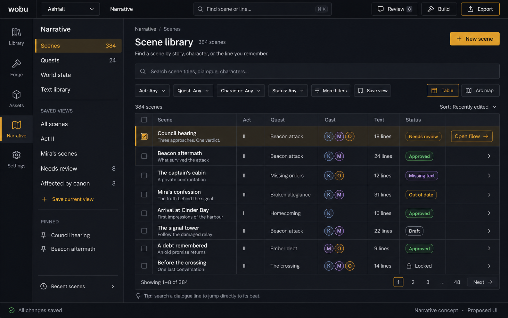
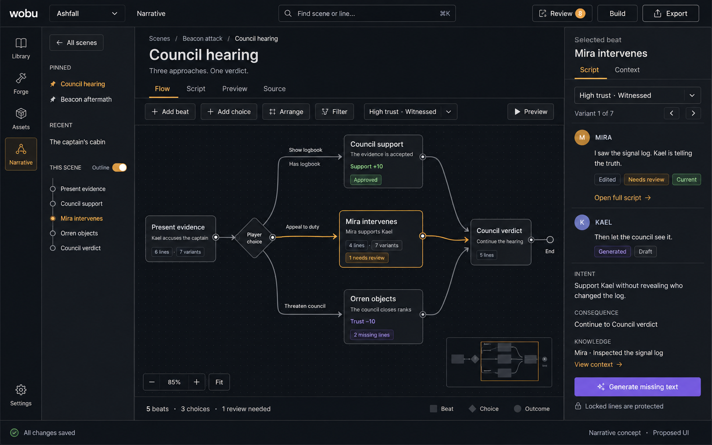

# 17 — Narrative system: user stories and delivery plan

Status: **In progress**. Flow, scene discovery and manual Script/Source are merged. The current
increment adds attributed World state, typed scene forms, deterministic compiler/runtime
foundations, isolated Preview and cancellable prose-generation jobs. Full editorial acceptance and production workflows remain
in progress or planned; N5 engine integrations are excluded from current work. See
[current authoring scope and evidence](19-narrative-authoring.md). The typed records, declared
state, stable identities and the versioned source/runtime type boundary are in
[the narrative domain model](34-narrative-domain-model.md).
GitHub milestones and issues below track the remaining acceptance criteria.

## Product contract

Wobu authors world state and narrative intent, generates prose during content production, and
exports an entirely offline, deterministic story for a game engine. The writer defines structure,
conditions, and consequences. Generation fills identified text slots; it cannot invent executable
branches, change state, or decide what a player choice does.

Keep React/Tauri and the existing Rust domain, store, provider, and job infrastructure. Add typed
narrative domain/compiler/runtime crates with no Tauri or provider dependency in the runtime.
Start with structured YAML source, a typed intermediate representation, and a versioned JSON
export. Add the writer-oriented DSL as another frontend to that same representation. All canonical
source, generated receipts, accepted text, locks, and production metadata live in the project
folder. SQLite remains a disposable local index, never a shared canonical database.

The first engine adapters target Unity and Godot; Unreal and a capability-checked Yarn Spinner
export are part of the full plan. Native JSON is the complete contract. Exporters must diagnose
unsupported features rather than silently approximate their meaning. Ink export, a general-purpose
scripting language, an embedded game editor, and runtime AI are outside this implementation.

World canon is distinct from a character's belief and from a particular playthrough's state.
Knowledge carries provenance and temporal/state conditions. A rumour can be false. An unknowable
future cannot be treated as an established past merely because it exists in the authoring database.

## Proposed workspace

**Library, Flow, and Script are three coordinated views of one narrative model.** Add Narrative
to the existing mode rail. Keep existing Library/Forge/Assets workflows available. The earlier
mockup's project-wide scene tree is superseded by a main-workspace scene library; the earlier
optional branch map is superseded by a first-class Flow editor.

| View | Main job | Primary surface |
| --- | --- | --- |
| Scene library | Find scenes across hundreds of entries | Searchable table, filters, saved views, pins and recent scenes |
| Flow | Author and inspect branching structure | Scoped canvas, typed nodes/ports, connections, selected-beat inspector |
| Script | Write and review dialogue | Readable line editor, variant selector, revision comparison and context |

### Scene library

Use the main workspace for a scene table with title, act/arc, quest, cast, text coverage and
editorial status. A small sidebar contains categories and saved views, not the entire story tree.
Search includes titles, intent and dialogue; a line match opens its exact beat/line/variant.
Combine filters for act/arc, quest, character, tags, policy, approval and freshness. Save personal
views such as Act II, Mira's scenes, Needs review, and Affected by canon.

A scene may participate in multiple quests/arcs; membership is a relationship, not a reason to
duplicate it or force it into one folder. Querying, sorting and virtualized/paged results must
remain responsive on the large-project fixture. Show actual totals and matching counts.

Opening a scene enters its editor. **Back to scenes** restores the query, filters, sort, scroll
and selected result. Pinned/recent scenes and navigation history provide quick switching. Personal
views and viewport preferences remain local to the writer.

### Flow editor

The centre is a graph canvas with **Flow / Script / Preview / Source** tabs. The left sidebar
contains Back to scenes, pinned/recent scenes and an optional outline of the current scene only.
The right inspector exposes the selected beat's script, variants, context and authored consequences.

Flow has two scopes:

- **Quest/arc:** each node is a scene; edges are explicitly authored transitions. Enter a scene
  to inspect its internal flow, then return with the arc viewport and selection restored.
- **Scene:** nodes represent beats, choices, conditions, outcomes and explicit endpoints. Typed
  ports/edges author destinations through the same undoable operations as forms and Source.

The council hearing shows Present evidence leading to three choices: Show logbook reaches Council
support, Appeal to duty reaches Mira intervenes, and Threaten council reaches Orren objects. All
three routes join the same Council verdict. The visual layout makes divergence and reconvergence
explicit. A beat with twelve lines and seven generated variants remains one node; text and variants
stay in Script/the inspector, not as twelve or eighty-four boxes.

Provide fit/zoom, scoped search/filtering, group collapse, minimap, manual positioning and on-demand
automatic layout. Evaluate React Flow plus an external layout engine in #184; the library choice
does not change the portable narrative contract. Avoid rendering the whole project's expanded
graph. A complete keyboard/screen-reader outline/form alternative offers equivalent operations.

Selection is shared by stable scene/beat/line ID across Flow, Script, Source, search, diagnostics
and Preview. Switching view preserves dirty edits and targets the same item. Script handles full
prose editing, variant comparison and review; the inspector is a compact entry point into it.

**Layout is presentation metadata.** Positions, groups and canvas annotations use a versioned
sidecar keyed by stable IDs. They are excluded from semantic source, compiler/generation hashes
and runtime exports. Panning, arranging or moving a box cannot make dialogue stale. Layout
recovery/sync is isolated from source writes; viewport/zoom stay machine-local.

### Preview, review and build overlays

Preview can highlight the played route, current node, available choices not taken and unavailable
choices. Show failed conditions and actual evaluated values; overlays are pinned to a build and
never mutate canon or layout. A graph selection highlight is distinct from an executed path.
The logbook choice is unavailable only when Has logbook is false; do not depict an Always choice
as unavailable without an explicit condition in the fixture.

Flow badges show missing text, needs review, out-of-date and locked counts, plus compiler errors
and coverage results. Badges open the relevant line/field or witness scenario. Filtering can reduce
the visible graph but must keep a visible summary of hidden blocking diagnostics; it cannot waive
release gates. Scope choices and generation plans stay separate from actual LLM execution.

Review opens the project-wide comparison queue. Build opens an affected-content plan before any
generation starts. Export selects a target/profile and reports blockers. Exact prompts and compiler
details remain available on demand; the normal UI speaks in facts, intentions and consequences.

Empty projects offer Create first scene and the original Ashfall example. Lists, canvas and forms
need loading, error, read-only, conflict and empty states. Provide keyboard navigation, accessible
labels, both themes, high UI scaling and colour-independent status encoding.

### Visual concepts

These built-in imagegen mockups show planned UI, not implemented functionality. The full prompts
are saved beside the images.

[Scene library generation prompt](mockups/narrative-library-v2.prompt.md).

[Flow generation prompt](mockups/narrative-flow-v2.prompt.md).

The [earlier document/tree mockup](mockups/narrative-workspace-v1.png) and its
[prompt](mockups/narrative-workspace-v1.prompt.md) are retained as design history. Its project-wide
tree and secondary graph arrangement are superseded by the Library / Flow / Script design above.

## User stories

### US-01 — Establish who knows what

As a world designer, I open **World state → Facts**, create `beacon_attack`, and record the canonical
event. On **Kael → Narrative**, I mark it witnessed; Mira was told by Kael; Orren heard a rumour.
I can record a mistaken belief without changing canon. A condition picker specifies when each
knowledge record becomes available. Selecting the fact shows its users and source links.

Success: the Context inspector explains each character's allowed knowledge for a selected scene
state. A future revelation is visibly excluded. Deleting the fact shows affected references.

### US-02 — Outline a playable scene without writing dialogue

As a narrative designer, I choose **New scene**, name Council hearing, add three existing
characters, and set `beacon_quest = investigating`. I add a Present evidence beat, specify each
participant's intent, then enter choices and typed consequences in a table. A variable picker
offers declared variables and compatible operators instead of asking me to write code.

Success: I can reorder beats, connect an outcome to its destination on the Flow canvas or in the
form, see three routes reconverge on the verdict, undo a deletion, and follow a diagnostic to the
unresolved node. Missing prose is shown as a task, not silently generated on save.

### US-03 — Write canonical dialogue myself

As a writer, I open **Script**, add a line to a named slot, choose its speaker, and type the text.
I can mark it locked immediately without ever configuring an LLM. Scene/beat/slot IDs survive
renaming and reordering; duplicating creates new identities.

Success: a complete handwritten scene plays and exports offline. Text changes create a revision;
they do not change the line's identity or silently rewrite localisation/audio references.

### US-04 — Generate only the text I need

As a writer, I select Present evidence and choose **Generate missing text**. The plan lists the
relevant trust/knowledge configurations, requested lines, model, and skipped locked content.
I inspect the Context panel, correct an erroneous fact, and start the job. Drafts arrive by slot.

Success: I can cancel or retry failed items without losing successful drafts. Generation cannot
alter choices or effects. No price is fabricated when the provider does not supply one.

### US-05 — Edit and approve a draft without losing my writing

As an editor, I open **Review**, filter to Mira, and compare a draft with the current line. I edit
one sentence, accept another, and reject a third. Regenerating my edited line creates a proposal
beside it. Accepting a proposal is an explicit guarded write against the revision I reviewed.

Success: a concurrent edit produces a conflict with both versions recoverable. A locked line
cannot enter a generation job, even if a caller bypasses the UI.

### US-06 — Understand the impact of changing a character

As a character writer, I change Kael's voice to more sarcastic. **Build → Affected content** lists
the lines that depend on that voice, the reason each is out of date, and counts grouped into
generated, edited, and locked. I select a subset and generate replacements.

Success: unrelated lines remain untouched; edited lines await comparison; locked lines remain
visible as out of date until a reviewer resolves the mismatch. Freshness is never reset merely
because a line was locked.

### US-07 — Play and debug a branch

As a designer, I open **Preview**, choose a High trust / Witnessed scenario, and play the scene.
I select Show logbook and see the displayed line, the choice condition, and support increasing by
10. I restart with a low-trust scenario or restore a saved checkpoint.

Success: preview never modifies canonical world facts. The state/decision trace links back to
the responsible beat and lights the played route on the Flow canvas, where an unavailable branch
explains which condition failed. A saved scenario can become a regression test.

### US-08 — Find impossible or uncovered story paths

As a narrative QA tester, I open **Validation** from Build. I see a dangling beat, overlapping
variants, an uncovered reachable state, and a future-knowledge warning. Each result identifies
the scene/beat, marks the responsible node on the Flow canvas, and, where possible, offers a
witness scenario that opens directly in Preview.

Success: the UI distinguishes proven unreachable, reachable, and unknown. External game inputs
and bounded analysis are reported honestly. Prose consistency checks assist human review;
they do not claim to prove that an LLM never revealed a secret.

### US-09 — Author ambient and supporting text

As a writer, I use **Text library → New** to create a bark, ambient exchange, companion reaction,
codex entry, quest summary, or journal entry. Each template exposes its relevant speaker,
trigger, context, variant conditions, and text slots. Ambient conversations may have multiple
speakers; barks have a repeat/selection policy.

Success: these assets use the same IDs, generation, review, freshness, and export workflow as
scene dialogue. They do not require fake player choices to exist.

### US-10 — Hand locked text to localisation and audio

As a production editor, I filter **Review → Approved**, lock a selection, and export a locale pack
and recording script with stable line IDs, revision hashes, speaker, and delivery notes.
I import translations and recorded or externally generated audio/lip-sync files by line ID.

Success: missing, duplicate, unknown, and outdated rows have actionable diagnostics. Unlocking
and changing an approved line marks its translations/audio out of date without discarding them.
Release export cannot silently ship stale mandatory production assets.

### US-11 — Integrate the same story in a game engine

As a game developer, I choose **Export → Native JSON**, import the package into Unity, Godot, or
Unreal using the matching adapter, bind `start_combat` to gameplay, and attach a dialogue UI.
The game supplies declared inputs; the narrative runner yields lines, choices, and commands.

Success: identical inputs/choices produce identical traces in the supported engines. Saving
during a pending game command and restoring does not apply a consequence twice. The exported
package contains no provider credentials and requires no Wobu process or network access.

### US-12 — Build a release without generating new content

As a build engineer, I run the packaged narrative CLI in CI against committed project files.
Check/compile/export use accepted text, validate the selected release profile, and emit a
deterministic package and machine-readable diagnostics. Generation is a separate explicit command.

Success: a missing or stale required line fails with its ID and remedy; a release build never
silently calls an LLM. Two clean builds from the same pinned inputs produce identical payloads.

### US-13 — Collaborate and recover safely

As a writer, I edit a scene while another writer edits dialogue on a peer or share. Independent
edits converge. Competing edits surface in the existing conflict flow with meaningful scene/line
names. I can close during generation, reopen, inspect completed drafts, and retry incomplete work.

Success: copying the folder to a fresh machine or rebuilding SQLite preserves source, accepted
text, proposals, receipts, locks, and production metadata. Existing art projects still open.

### US-14 — Work in source when that is faster

As a technical narrative designer, I open **Source** to edit structured YAML, or import the
writer-oriented DSL. Errors underline the relevant location and link to the form field. I can
format source and inspect the compiled graph without changing stable identities.

Success: source and forms edit one canonical model with an explicit save/reload boundary. They
never become two divergent authoritative copies. Unsupported syntax is rejected with a location.

### US-15 — Find a scene in a large narrative

As a writer, I open Scene library, filter to Act II and Mira, and search for a line I remember.
The result shows its scene, matching text and beat. I open it in Flow, switch to Script at the
same selection, then return to the library without losing the query or scroll position. I save
this search as a personal view and pin the scene for tomorrow.

Success: hundreds of scenes are accessible through search, facets and saved views. A scene linked
to two quests remains one scene. The left outline contains only the selected scene's structure.

### US-16 — Design branches visually without multiplying prose nodes

As a narrative designer, I open Council hearing in Flow, add a player choice, and connect three
outcomes to a single Council verdict. Selecting Mira intervenes opens its script and context in
the inspector. Its seven variants remain in a selector. I rearrange nodes, play a scenario and
inspect the highlighted route, then follow a diagnostic to the responsible field.

Success: Flow, Script and Source edit the same stable IDs through undoable commands. Rearranging
the canvas changes no narrative source, freshness or package. Equivalent keyboard/form operations
remain available, and quest/arc drill-down restores the parent view.

## Content lifecycle

Keep three independent dimensions on each text revision:

| Dimension | Values | Behaviour |
| --- | --- | --- |
| Generation policy | Generated / Edited / Locked | Replace eligible generated text; propose changes to edited text; never generate locked slots |
| Review | Draft / Approved | Approval applies to the exact text revision and reviewed context |
| Freshness | Current / Out of date | Derived from source/context dependencies; applies to all policies |

Human-authored text starts Edited or Locked by explicit choice. A changed approved generated
line becomes Draft. Unlocking does not itself alter the text. Changing source invalidates the
relevant approval/context attestation even when the locked wording is preserved. A reviewer can
affirm that unchanged wording still fits the new context; that decision is recorded. Review and
export enforce revision checks so an older proposal cannot overwrite a newer edit.

Stable IDs identify slots/lines; separate revision hashes identify wording and provenance.
Renames never derive new IDs. New variants get new IDs. Deletions retain enough tombstone/history
information to explain broken production references and save compatibility.

## Runtime and build boundaries

- Typed conditions/effects with finite declared state domains where practical; no embedded
  JavaScript, Lua, engine expressions, or arbitrary code evaluation in the portable contract.
- Define integer bounds/overflow, missing variables, branch priority, locale fallback, seeded
  selection, command acknowledgement, and effect ordering. One owner per state variable.
- Preview and native engine adapters share conformance fixtures. Runtime state includes cursor,
  variables, visit/selection state, pending commands, and content/schema versions.
- Generation fingerprints include resolved context, dependency/query membership, source and
  prompt schema versions, provider/model identity, and settings. Reusing stored output is
  reproducible; asking the same LLM again is not promised to reproduce it.
- Scope permutations to state that affects an asset. Use finite enumeration first, configurable
  limits, and conservative unknown results for external inputs. More powerful solver work must
  earn its complexity; exact whole-game reachability is not promised.
- Native packages contain graph/state schema, locale string tables, media references, a
  version/capability manifest, and optional debug source maps. Release packages omit author-only
  prompts and private context. Original source and accepted receipts remain in the project.
- Production includes recording/TTS handoff and importing audio/lip-sync outputs, not building
  a speech synthesiser or phoneme aligner. Engine playback consumes prepared assets.

## Delivery sequence

Six narrative milestones use an **N** prefix so they do not collide with the existing M0–M12
roadmap. No dates are implied. Each milestone is complete only when its UI and validation work,
not merely when backend APIs exist.

1. **N1 — Narrative world and scene authoring:** model, safe storage, workspace, knowledge,
   a searchable Scene library, scene forms, the scene Flow canvas, layout sidecars and source editing. A writer can find and save a complete original handwritten scene.
2. **N2 — Deterministic compiler and playable preview:** typed compilation, runtime contract,
   native package, preview, the arc Flow view and played-route overlay, and scenario regression tests. The handwritten scene runs offline.
3. **N3 — Generation and editorial review:** context resolution, jobs, protected content
   lifecycle, review queue, and supporting narrative asset types. Draft-to-approved is usable.
4. **N4 — Incremental builds and narrative analysis:** dependency tracking, affected builds,
   bounded variant planning, diagnostics on the Validation list and Flow canvas, and DSL syntax. Changes regenerate only eligible work.
5. **N5 — Portable engine integrations:** shared conformance fixtures, Unity, Godot, Unreal,
   and Yarn export. The same original example runs with matching traces across native adapters.
6. **N6 — Production pipeline and release readiness:** localisation, voice/lip-sync handoff,
   offline CLI, collaboration recovery, scale/accessibility, documentation, and acceptance evidence.

## Implementation alignment

Merged [PR #190](https://github.com/krazyjakee/wobu/pull/190) established Flow, and
[PR #192](https://github.com/krazyjakee/wobu/pull/192) added working discovery, Script and Source.
The current implementation includes World state, typed forms, source repair, a compiler/runtime-backed
Preview with evaluated traces and command results, explicit save migration, native package export,
saved regression scenarios, attributed context, generation jobs and guarded editorial review.
Detailed behavior and evidence limits are in [the authoring guide](19-narrative-authoring.md).
The issue index below retains unchecked full-acceptance items; implementation of a foundation
is not a claim that every criterion is complete. N5 is excluded from this work by user direction.

| Plan element | Implemented foundation | Remaining work |
| --- | --- | --- |
| Scene and arc Flow | React Flow, scene drill-down, guarded structural saves, arc grouping by World quest or starting quest stage, and the played-route overlay. | A scene several quests list draws in the first only; quest transitions are not drawn as edges, and native acceptance remains (#187/#186). |
| Separate layout | Versioned scene/quest sidecars, shared mode/groups/notes, separate watcher and peer merging; native canvas and Release invariance evidence. | Platform coverage and broader accessibility acceptance (#182/#186). |
| Scene discovery | Paged text/intent search, lifecycle and multiquest facets, local saved views, pins/recent and return navigation. | Scene-library use of the rebuildable record index, act/tag metadata and real-load benchmarks (#194/#182). |
| World state | Canonical facts, independent beliefs/provenance, directed relationships, events, quest transitions/membership, restrictions and related entity IDs. | Complete backlink navigation (#155). Attributed context now has a [frozen request inspector](23-narrative-context.md); [provider jobs](25-narrative-generation.md) now retain separate prose proposals. |
| Script and inspector | Manual revisions, beat/slot/variant operations, typed conditions/effects, choices/outcomes and saved context. | Full structural undo/Flow equivalence and native workflow acceptance (#156). |
| Source | YAML editing/checking, explicit format/save/reload, guarded saves, malformed-file repair and semantic source ranges. | Crash-persistent drafts and production recovery (#181). |
| Compiler and runtime | Pure deterministic graph, source maps, release gates, typed runner, command protocol, validated save migration and native packages. Field-level [dependency tracking and invalidation](35-narrative-dependencies.md). | Incremental builds and analysis (#169–#171). |
| Preview | Isolated starting state, lines/choices, checkpoint restore, evaluated traces, typed command results, source links, saved scenario tests, native walkthrough and the Flow route overlay. | Cross-scene preview, which the arc view needs before it can draw more than a played badge. |
| Portable records | Canonical source/text/record envelopes, immutable receipts, complete publication manifests, rebuildable index, bounded peer sync and explicit deletion/recovery. | Richer domain payloads and production recovery (#181). |
| Generation and review | Frozen provider requests, immutable results, protected replacement, canonical approval evidence and a paged comparison/bulk Review queue. Supporting text (#167) authors, compiles, plays and exports through the same model. Precise [dependency tracking](35-narrative-dependencies.md) reports and explains affected lines. | Generating supporting text, listing it in the Review queue, planning affected rebuilds, localisation/audio and production release workflow. N5 engine integrations are excluded. |

## GitHub implementation index

[Parent tracker #151](https://github.com/krazyjakee/wobu/issues/151) holds the user stories and overall completion checklist. Each implementation issue carries acceptance criteria, verification, and explicit dependencies.

### [N1 — Narrative world and scene authoring](https://github.com/krazyjakee/wobu/milestone/15)

- [ ] [Define typed narrative entities, state, and stable identities](https://github.com/krazyjakee/wobu/issues/152)
- [x] [Persist narrative source, text revisions, and receipts safely](https://github.com/krazyjakee/wobu/issues/153)
- [ ] [Add the Narrative workspace and scene navigation](https://github.com/krazyjakee/wobu/issues/154)
- [ ] [Edit narrative facts, knowledge, relationships, events, and quests](https://github.com/krazyjakee/wobu/issues/155)
- [ ] [Author scenes, beats, choices, consequences, and handwritten dialogue](https://github.com/krazyjakee/wobu/issues/156)
- [x] [Support structured YAML source with diagnostics and form round trips](https://github.com/krazyjakee/wobu/issues/157)
- [x] [Spike: choose the Flow canvas library, layout engine, and node vocabulary](https://github.com/krazyjakee/wobu/issues/184)
- [x] [Persist Flow layout as presentation metadata separate from narrative source](https://github.com/krazyjakee/wobu/issues/185)
- [ ] [Add the scene Flow canvas for beats, choices, conditions, and outcomes](https://github.com/krazyjakee/wobu/issues/186)
- [ ] [Add a searchable Scene library with saved views and editor navigation](https://github.com/krazyjakee/wobu/issues/191)

### [N2 — Deterministic compiler and playable preview](https://github.com/krazyjakee/wobu/milestone/16)

- [ ] [Compile narrative source into a validated deterministic graph](https://github.com/krazyjakee/wobu/issues/158)
- [ ] [Implement the offline narrative runner and versioned save state](https://github.com/krazyjakee/wobu/issues/159)
- [x] [Export and validate versioned native narrative packages](https://github.com/krazyjakee/wobu/issues/160)
- [ ] [Play scenes in Preview with state controls and source-linked traces](https://github.com/krazyjakee/wobu/issues/161)
- [x] [Save narrative scenarios and assert branch regression traces](https://github.com/krazyjakee/wobu/issues/162)
- [ ] [Add the quest and arc Flow view with scene nodes and drill-down](https://github.com/krazyjakee/wobu/issues/187)
- [ ] [Highlight the played route and unavailable branches in Flow during Preview](https://github.com/krazyjakee/wobu/issues/188)
- [x] [Complete save migration and Preview decision traces](https://github.com/krazyjakee/wobu/issues/195)

### [N3 — Generation and editorial review](https://github.com/krazyjakee/wobu/milestone/17)

- [x] [Resolve attributed narrative generation context for each slot and state](https://github.com/krazyjakee/wobu/issues/163)
- [x] [Generate narrative drafts through cancellable provider jobs](https://github.com/krazyjakee/wobu/issues/164)
- [x] [Enforce revision-aware generation policy, approval, and freshness](https://github.com/krazyjakee/wobu/issues/165)
- [x] [Build the dialogue review queue and revision comparison UI](https://github.com/krazyjakee/wobu/issues/166)
- [ ] [Author and generate barks, ambient dialogue, reactions, and supporting text](https://github.com/krazyjakee/wobu/issues/167)

### [N4 — Incremental builds and narrative analysis](https://github.com/krazyjakee/wobu/milestone/18)

- [x] [Track narrative dependencies and invalidate affected content precisely](https://github.com/krazyjakee/wobu/issues/168) — see [dependency tracking](35-narrative-dependencies.md)
- [ ] [Plan and run affected narrative builds with safe resume](https://github.com/krazyjakee/wobu/issues/169)
- [ ] [Plan bounded narrative variants and prune unreachable configurations](https://github.com/krazyjakee/wobu/issues/170)
- [ ] [Surface narrative coverage and consistency diagnostics with witness previews](https://github.com/krazyjakee/wobu/issues/171)
- [ ] [Add the writer-oriented narrative DSL over the shared source model](https://github.com/krazyjakee/wobu/issues/172)
- [ ] [Mark diagnostics, coverage gaps, and stale or missing text on Flow nodes](https://github.com/krazyjakee/wobu/issues/189)

### [N5 — Portable engine integrations](https://github.com/krazyjakee/wobu/milestone/19)

Excluded from the current implementation at the user's request; these issues remain planned.

- [ ] [Publish the engine contract and cross-language conformance suite](https://github.com/krazyjakee/wobu/issues/173)
- [ ] [Ship the Unity narrative adapter and playable sample](https://github.com/krazyjakee/wobu/issues/174)
- [ ] [Ship the Godot narrative adapter and playable sample](https://github.com/krazyjakee/wobu/issues/175)
- [ ] [Ship the Unreal narrative plugin with Blueprint and C++ bindings](https://github.com/krazyjakee/wobu/issues/176)
- [ ] [Export supported narrative graphs to Yarn Spinner with capability checks](https://github.com/krazyjakee/wobu/issues/177)

### [N6 — Production pipeline and release readiness](https://github.com/krazyjakee/wobu/milestone/20)

- [ ] [Export and import revision-aware localisation packs](https://github.com/krazyjakee/wobu/issues/178)
- [ ] [Hand off recording scripts and import audio and lip-sync assets](https://github.com/krazyjakee/wobu/issues/179)
- [ ] [Package a headless narrative CLI for reproducible release builds](https://github.com/krazyjakee/wobu/issues/180)
- [ ] [Validate narrative collaboration, migration, and crash recovery end to end](https://github.com/krazyjakee/wobu/issues/181)
- [ ] [Validate narrative workspace accessibility and large-project performance](https://github.com/krazyjakee/wobu/issues/182)
- [ ] [Document and validate the complete narrative production workflow](https://github.com/krazyjakee/wobu/issues/183)
