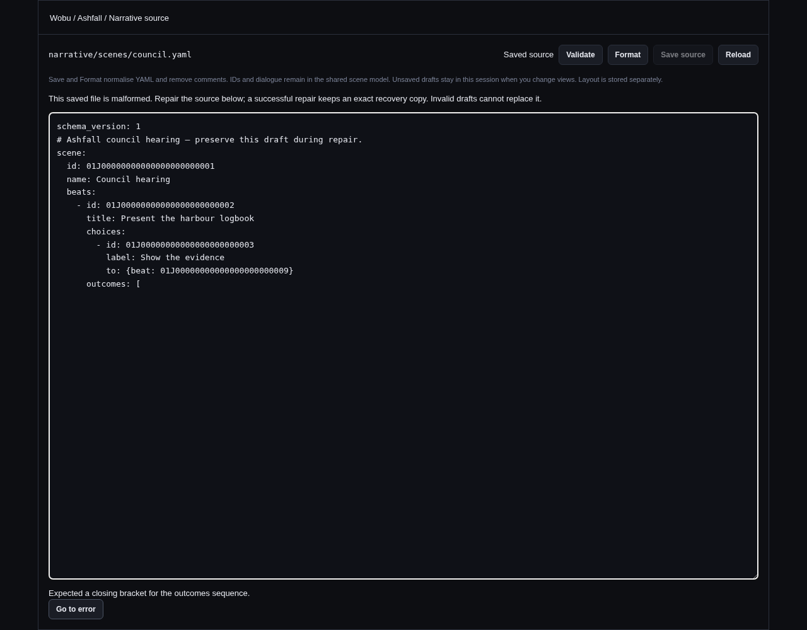
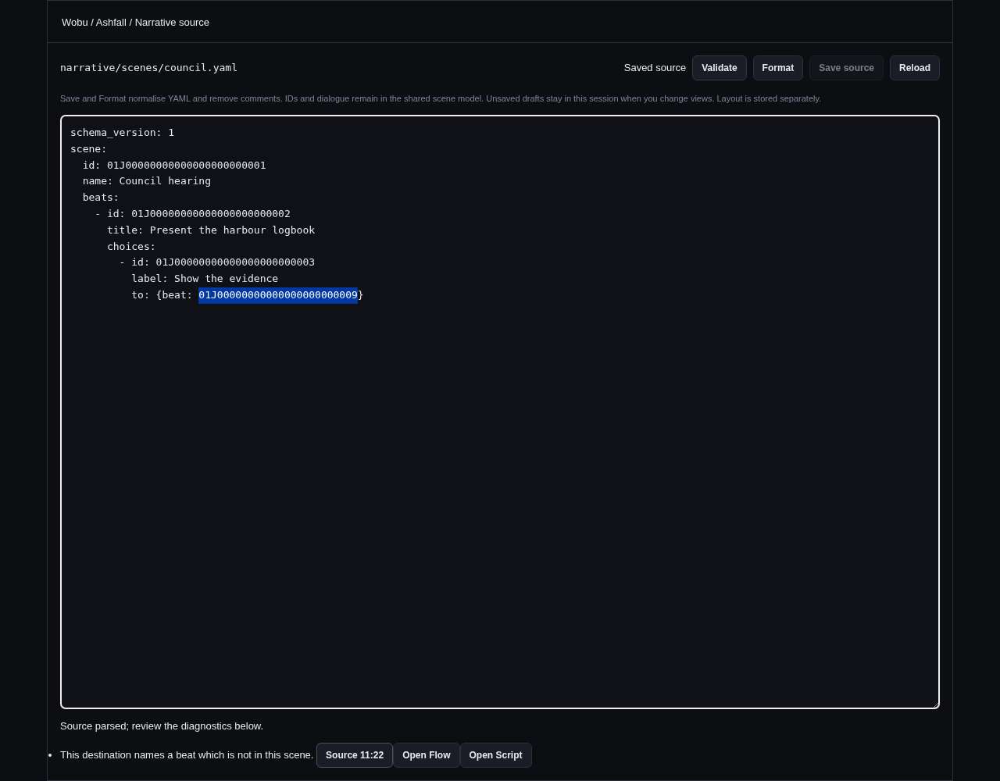

# Narrative Source editor

Source edits the same typed scene document as Script and Flow. It reads the exact saved YAML bytes
and their file stamp together. Validate parses a draft with the shared Rust model; the frontend YAML
CST reader only locates authored text, and never decides whether a document is valid.

Syntax and shape errors carry parser line/column locations. Semantic diagnostics carry structural
paths from the typed analysis: nested conditions, individual effects and command arguments,
destinations, speaker references, dialogue revisions, and duplicate identities select their
responsible values. `Source line:column` selects that range in the editor. Quoted keys, flow mappings,
block scalars, Unicode, and old YAML tags are supported. An alias selects its authored `*name` use and
is explicitly labeled as an alias; the editor does not expand it or jump to a shared anchor. Missing
fields select the nearest existing container. Flow/Script buttons target the corresponding stable
beat, choice, outcome, or variant identity.

## Save and formatting

Save is explicit and uses the same guarded write and undo history as Script and Flow. A known scene
ID cannot change through this editor. Unknown fields and unsupported schema versions are rejected
before saving. Structural diagnostics may remain in an unfinished scene, as in the other editors;
they still need to be addressed before production compilation. Neither validation nor saving source
replaces the previously compiled game artifact.

Reading preserves comments and formatting. **Format and Save normalize YAML and remove comments.**
Format changes only the draft; Save writes the canonical typed representation. The printer uses
ordered model fields, two-space indentation, LF newlines and a trailing newline. Layout stays in its
separate presentation sidecar. IDs, tombstones, human text including Unicode and multiline
whitespace, revisions, provenance, and editorial lifecycle fields survive round trips unchanged.
Script computes prose revisions; the shared write boundary refuses an approval for different wording.

Canonical enum payloads are singleton mappings, for example:

```yaml
entry:
  not:
    compare:
      var: has_logbook
      op: eq
      value: {literal: true}
```

The same serializer is used for scene, state and world documents, including integer/enum declarations
and nested knowledge/restriction conditions. Existing schema-1 `!compare`, `!literal`, `!int`, and
other tagged source remains readable. Valid mixed tagged/mapped documents are also accepted and
normalize to mappings on the next Format/Save. Normalization still passes through strict typed
parsing: it never drops unknown fields. For invalid mixed notation the parser can report the nearest
incompatible notation rather than the deepest payload; use one notation to obtain the most precise
syntax diagnostic. Source schema version 1 and the JSON bridge representation are unchanged.

## Drafts and concurrent edits

Unsaved drafts survive switching tabs, scenes, and workspaces in the running session. Drafts are
scoped by project and source identity/path and retain their original file stamp. A later form or
external edit causes a conflict instead of replacing the latest source. A failed save keeps the
draft. In-flight validation, Format, Save, and Reload results cannot replace a newer buffer, including
when a writer reverts to the clean saved text or remounts the editor while a request is pending.

Reload requires explicit discard of a dirty draft. Closing the project or quitting is blocked until
unsaved narrative drafts are saved or explicitly discarded, including drafts in unmounted tabs.
Drafts are not persisted across application restarts.

## Repair saved malformed source

The scene library lists unreadable files with a **Repair source** action. This works even if damaged
YAML has no readable scene ID. A malformed identifiable scene can also be opened through its Source
tab. The repair view shows the original raw bytes, parser problem, and original stamp; it does not
invent a scene or offer a general project file editor.

1. Correct the draft and Validate. Invalid YAML never replaces the on-disk file.
2. Save source. The proposed scene must use the known identity, when one can be read, and must not
   reuse another file's scene ID. Approved text must retain its matching revision.
3. The original bytes are retained in
   `narrative/recovery/<scene-id>.<original-content-hash>.yaml` before the guarded repair write.
   The success message gives the recovery path. This immutable copy is outside scene discovery and
   compilation; repeated identical recovery writes are safe and different bytes are never overwritten.
4. If the source changed on disk, the current file wins and the usual conflict sibling preserves the
   proposed repair. Reload or resolve the conflict before continuing.

Repair accepts only regular files directly in `narrative/scenes/`; path traversal, conflict siblings,
and symbolic links in scene path components or recovery storage are refused. Unsupported saved schema
versions are read-only: repair cannot downgrade them by deleting newer fields or changing the version.
A file that has become valid must use the normal save path after Reload. Repair has no semantic undo
entry because its prior bytes are not a typed scene; recover the original from the retained copy if
needed. Normal saves after repair share the usual Script/Flow undo history.

## Verification and UI evidence

Rust tests use real temporary project files for raw reads, invalid drafts, immutable recovery,
concurrent writes, identity collisions, unsupported saved versions, symlink refusal, approval checks,
and preservation of layout and compiled bytes. Shared-model tests cover canonical, tagged and mixed
source, nested scene/world conditions, state declarations, strict unknown fields, stable IDs, text,
lifecycle/provenance, and repeated canonical bytes. Frontend tests cover project-scoped drafts,
late-response races, read-only/repair controls, library repair navigation and exact source selections.

The screenshots below use the actual React Source component in Chromium with explicit mock IPC and
an Ashfall fixture. Browser navigation verified syntax selection, repair, validation, and exact target
selection without page errors. These are browser UI evidence, not a claim of native Tauri execution.




