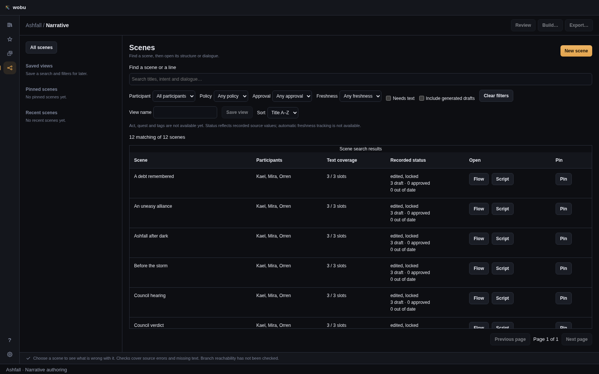
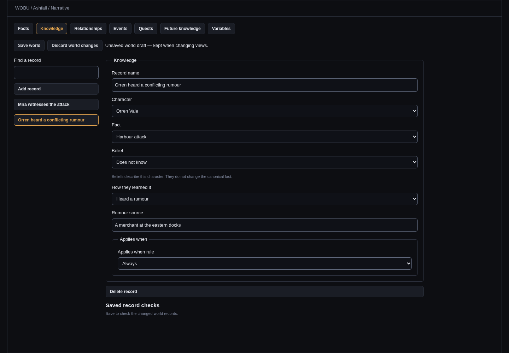
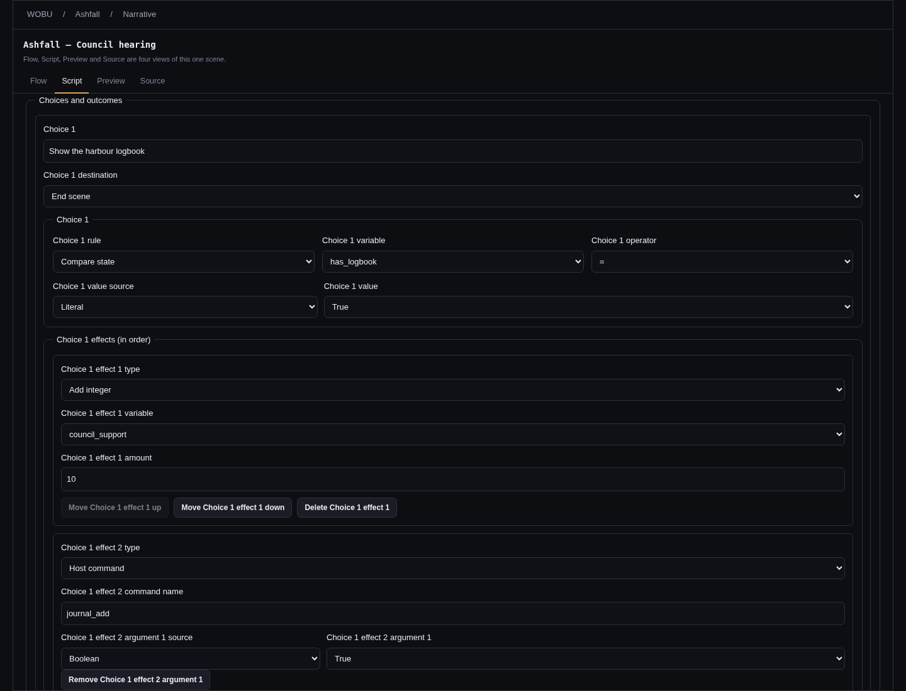
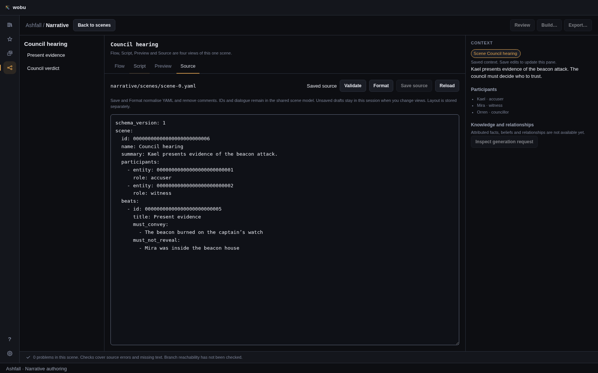
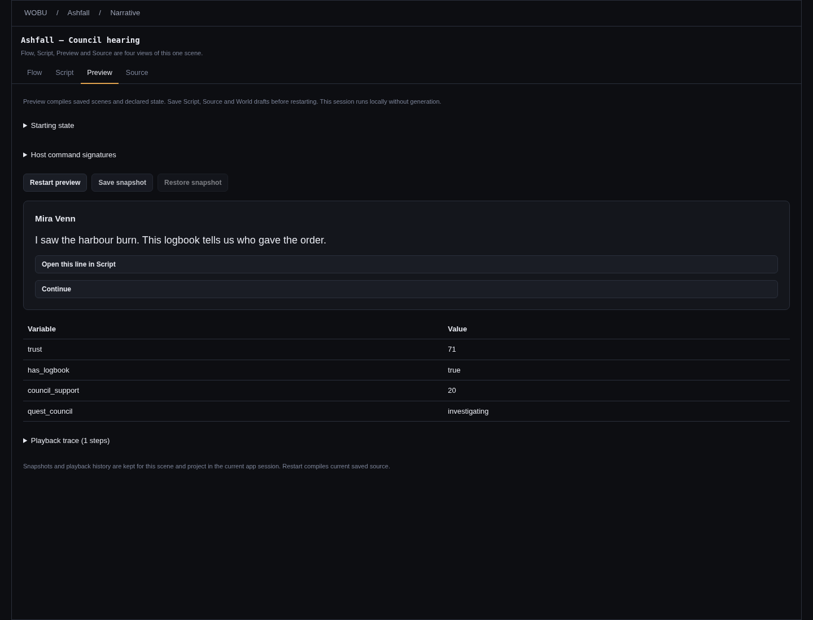

# Narrative authoring: current implementation

Merged PRs [#190](https://github.com/krazyjakee/wobu/pull/190) and
[#192](https://github.com/krazyjakee/wobu/pull/192) established Flow, scene discovery, handwritten
Script and YAML Source. The current implementation adds attributed world records, typed scene
forms, a deterministic Rust compiler/runtime and playable Preview. These are working foundations;
the [delivery plan](17-narrative-system.md) records the acceptance still outstanding. N5 engine
integrations (#173–#177) are excluded from this work at the user's request.

## Find a scene

Narrative opens a paged scene table. Search matches scene names, summaries, beat titles, authored
intent, required content and dialogue. Each matching passage carries scene, beat, slot and variant
identity into Flow or Script. Generated draft text is an explicit search option. Quest, participant,
policy, approval, freshness and missing-text filters combine; policy/approval/freshness must match
the same variant. Library facets use recorded source mirrors; the Review workspace derives verified
approval and freshness from canonical evidence. Precise dependency builds remain #168.

A quest owns an explicit list of scene IDs. A scene can belong to several quests and appears once
in the table, with every membership in its Quests column; either quest filter finds it. Set those
memberships in World state → Quests. Renaming a quest preserves saved filters because they use its
ID. A saved filter for a deleted quest stays selected with an explanation until changed or cleared.

Saved views, pinned/recent scenes, query, sort, page, selected row and scroll position are local to
the project path on this machine. Older saved views acquire an empty quest filter. Back to scenes
retains the view. Only 25 result rows are mounted; scene documents still load through existing
queries, so this is not an indexed search backend. Act and tag metadata remain unimplemented.

The earlier library screenshots show the base discovery layout before the quest column was added:

[Light-theme library](screenshots/narrative-library-light.png).

## Establish world knowledge

Open **World state** to edit facts, knowledge, relationships, events, quests, future knowledge and
variables. A fact records its canonical assertion and sources. Related world entities link facts
and events to existing characters or places. A knowledge record separately identifies its character,
fact, belief, provenance and acquisition condition. For the same attack fact, Kael can have witnessed
it, Mira can have been told by Kael, and Orren can believe a contradictory rumour. Recording false
or unknown belief never rewrites the canonical assertion.

Relationships are directed: Kael trusting Mira does not manufacture a reciprocal relationship.
Events reference established facts and an applicable condition. Quests declare their stages,
initial stage, conditional transitions and scene memberships. Future knowledge restrictions name
a fact and the characters who must not reveal it until a condition holds. An empty character list
means everyone; **Never** keeps the restriction in force indefinitely. These records author intent
and constraints. Select a dialogue line to [inspect attributed generation context](23-narrative-context.md), including its speaker’s knowledge and frozen source dependencies.

**Variables** declares the finite domains used by conditions: booleans, bounded integers and named
values. Names use lowercase letters, digits and underscores, starting with a letter; reserved YAML
words such as `true`, `false` and `null` are not names. Narrative-owned variables may be assigned by
story effects. Host-owned variables are read by the story and supplied by its host. Changing or
removing declarations can invalidate existing conditions; renaming does not rewrite references.

**Save world** writes `narrative/world.yaml`; variables stay in `narrative/state.yaml`. World records
retain stable IDs through renaming and undo. Semantically incomplete records, such as references to
removed facts, can be saved and return record/field diagnostics. Malformed identities, invalid name
syntax, unknown fields and unsupported versions are rejected. Local unsaved drafts are retained
when a save fails. The detail pane lists reference users before deleting a referenced world record;
removing it retains those users and exposes their dangling references.

## Write a scene

Script edits the same scene as Flow: scene metadata and participants; beat add, reorder, duplicate
and delete; intents and required/forbidden content; dialogue slots and variants; choices, automatic
outcomes and explicit destinations. Typed controls now edit scene entry, variant, choice and outcome
conditions. Variable/operator/value pickers use the declared schema; effect rows edit assignments,
increments and host commands. Outcomes and variants retain authored priority order. The first
matching variant is selected; available choices take precedence over automatic outcomes, whose
first matching entry is used. See the [runtime contract](17-narrative-runtime-contract.md) for the
precise evaluation and effect rules.

Save script computes wording revisions in Rust, records human provenance, resets changed wording
to draft. Manual wording starts Edited or Locked. Locked text must be explicitly unlocked before
editing. Duplication allocates new identities while preserving words, provenance and revisions;
the new identity needs its own review, and copied Generated wording becomes Edited. Existing
locks remain protected. Guarded saves and structural changes enter the shared undo history. The
inspector displays saved participants, intent, restrictions and selected dialogue. The World editor
is the place to author attributed facts. The Context inspector resolves speaker-specific knowledge,
relationships, restrictions and voice into a frozen request with source dependencies.

YAML edits the same model through [Source](18-narrative-source-editor.md). Explicit formatting/save
normalises YAML, including comments. Semantic diagnostics use stable IDs to locate exact YAML
source ranges, including nested conditions and effects.

## Play and inspect

1. Save the scenes and variable declarations used by the scenario, then open a scene's **Preview**.
2. Set its **Starting state** using the declared variable domains. Preview can override narrative
   defaults and host inputs for this isolated run without editing project canon.
3. If authored effects use host commands, declare their argument signatures under **Host command
   signatures**. For example, `{"camera_closeup": ["bool"]}` registers one boolean argument.
4. Select **Start preview**. Saved project scenes compile into an internal deterministic graph.
   Compilation diagnostics link back to Script; structural/type errors prevent starting. Development
   warnings permit incomplete text to compile, but reaching a slot without a matching variant stops
   playback with a no-match error.
5. Read lines with **Continue**, choose available responses, and inspect the current state and
   playback history. **Open this line in Script** follows the yielded scene/beat/slot IDs.
6. Use **Save snapshot** and **Restore snapshot** to revisit a checkpoint, or **Restart preview** to
   compile the latest saved source and use the starting inputs again.

A command pauses Preview and displays its name and arguments. Return success with typed host
values, failure, or cancellation without performing a game action. Failed and cancelled commands
remain pending for an explicit retry; restoring a pending checkpoint preserves command identity.

The running session retains its compiled graph. Source edits do not change it mid-play; restarting
compiles again. Checkpoints and playback history survive view changes within the app session and
are scoped to the project/scene. **Save scenario** records a separate portable action/assertion tape;
**Load scenario** replays it against current source. Build’s **Scenario tests** reports the first
divergence with source links. See [saved scenarios](22-narrative-scenarios.md) for limits and the
six-case Harbor Watch fixture. Playback history
shows evaluated conditions, transitions, effects before and after, and command results with source
links. Each action retains at most 2,048 trace records and reports omissions explicitly; the UI keeps
100 actions. Flow route overlays remain #188.

The compiler and runtime are pure Rust crates independent of Tauri, providers and the authoring
store. Preview commands adapt them to the app without writing world/project state. This internal
graph can be exported as a [validated native package](20-native-narrative-packages.md). Engine
adapters remain excluded N5 work. There is no generation call in compilation or playback. Release validation rejects missing required text
and wording without verified approval for its exact identity, revision and current reviewed context.
Writable lifecycle flags cannot supply that proof. Precise dependency invalidation is still #168.
First-match selection is deterministic; a seed is retained for a future selection policy. The pure
Rust runtime supports signed 64-bit integers; the JavaScript Preview bridge rejects values or
declarations outside JavaScript's safe-integer range so IPC cannot silently round them.

## Protect drafts and saves

Script, Source and World/Variables drafts survive view changes within the session and retain their
original file stamps. A later save from another writer produces a conflict rather than silently
replacing newer work. Late save completion cannot clear a newer reopened draft. Closing a project
or quitting requires retained drafts to be saved or discarded, including drafts in hidden views.
Drafts are not crash-persistent. Source can open malformed scene files through the Library repair
action. Repair preserves the exact original in an immutable recovery file before guarded
publication; future source versions remain read-only. Canonical YAML uses mappings for nested
conditions and effects, while existing tagged source remains readable.

World undo/redo compares the expected whole document under the project lock and then performs a
guarded write using its current stamp. It refuses a changed document from another writer. Ordinary
World saves cannot request an unguarded `Current` precondition. Scene undo also compares the expected
authored document, retaining a refused entry rather than overwriting a collaborator. Coalesced typing
uses the original and final document as its undo/redo guards and does not absorb an intervening peer
edit. Variable edits use guarded stamp-based saves but do not yet enter undo history.
[Portable storage and Recovery](24-narrative-storage.md) preserve peer conflicts and explicit deletions;
crash-persistent drafts and production recovery remain #181.

The shared scene write boundary rejects forged approvals, history heads and policy unlocks.
Restoring words does not revive a previous approval. [Editorial review](26-narrative-review.md)
records immutable decisions; missing or mismatched history invalidates proof while preserving words
and locks. World source participates in the narrative fingerprint; moving Flow boxes does not.

## Arrange Flow

Choose a scene or World quest in **Flow scope**. Shared arrangements retain Automatic/Manual mode,
node positions, collapsed groups and pinned notes. **Groups & notes** edits that presentation; the
separate save queue offers an explicit retry if a write fails. Viewport and panels remain local.
[The arrangement guide](27-narrative-layout.md) describes peer merging, schema compatibility and
native reopening evidence, including the 300-node canvas bound. Layout-only edits preserve canonical
source, review evidence, context fingerprints and Release package bytes.

## Generate and review

**Generate…** plans saved dialogue requests before explicitly queuing provider work. Both slot and
variant must remain Generated for automatic replacement; Edited wording retains a proposal, and
Locked wording is skipped. Results and provider receipts remain available through interruptions.
Generation does not grant approval. See [generation jobs](25-narrative-generation.md).

**Review** opens a paged queue with scene, speaker, policy, approval and freshness filters. Compare
current and proposed wording, inspect its context, accept or edit a proposal, approve exact wording,
or attest unchanged wording against changed context. Bulk decisions show eligible, skipped and
conflicting results before applying one guarded transaction per scene. Local drafts retain their
original comparison guard through navigation and refresh. The [review guide](28-narrative-review-queue.md)
includes the complete workflow recording with its mocked-provider evidence limits.

## Evidence and remaining acceptance

Screenshots use the actual React components with explicit in-memory IPC fixtures in Chromium.
They establish browser rendering. Native layout evidence is identified separately in the arrangement
guide. The separate [native Preview walkthrough](21-native-narrative-preview.md)
records real Tauri/WebKit and Rust IPC, including command results, restore, bounds and loop failures;
its canonical project-file audit verifies isolation. Rust command tests use temporary project files. Current regression coverage includes attributed
three-character knowledge, contradictory/unknown belief, entity backlinks, strict source/version
checks, guarded world saves and undo, typed forms, multiple quest membership and saved views,
compiler release gates, runtime yield/snapshot boundaries and Preview's isolated state.

The earlier #192 benchmark uses 1,000 scenes and 50,000 slots already loaded in memory. Its initial
run found a remembered line in 14–32 ms; it does not establish SQLite, filesystem, IPC or native
frame-time performance. Full current check totals belong in the implementation PR's verification
record, rather than reusing #192's counts for the changed implementation.

| Issue | Implemented in this increment | Still outstanding |
| --- | --- | --- |
| #155 | World model/forms, provenance, restrictions, quest stages/membership, related entities, diagnostics and guarded world undo. | Complete character/place backlink navigation and full native workflow acceptance. |
| #156 | Typed conditions/effects, automatic outcomes and variant controls alongside handwritten authoring. | Full public-command fixture/walkthrough and all structural undo/Flow equivalence acceptance. |
| #158 | Deterministic validated graph, source maps, typed effects/command signatures and development/release text gates. | Full acceptance review; wider analysis belongs to #170/#171. |
| #159 / #195 | Pure runner, bounded typed execution, command protocol, version/hash-checked snapshots and explicit validated migration callback. | No random variant-selection policy is authored yet. |
| #161 / #195 | Isolated Preview, starting state, checkpoints, evaluated traces, configurable command results and recorded native walkthrough. | Flow route overlays (#188). |
| #191 | Real multiquest filtering/column and migration of saved views. | Act/tag metadata, rebuildable index and real-load/native acceptance. |

Source repair and semantic ranges (#157), native packages (#160), migration/Preview traces
(#195), saved regression scenarios (#162), and attributed frozen generation context (#163) are
implemented alongside portable record indexing, peer sync and explicit recovery (#153).
[Cancellable generation jobs](25-narrative-generation.md) (#164) retain prose proposals and immutable
receipts; guarded editorial transitions (#165) and the Review queue (#166) share canonical evidence.
Supporting text (#167), incremental analysis
(#168–#172), Flow overlays (#188/#189) and production work (#178–#183) remain tracked. N5
(#173–#177) is deliberately excluded; no Unity, Godot, Unreal or Yarn integration was added.
