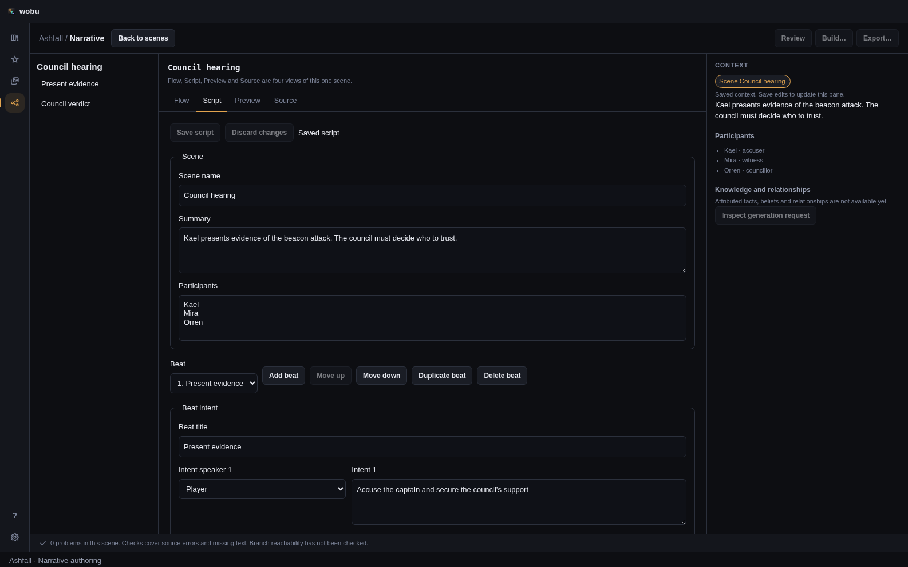

# Narrative authoring: current implementation

This increment builds on merged PR #190. It advances #154, #156, #157 and #191; these issues remain
open because their full acceptance includes world records, typed condition/effect forms, indexing,
and native acceptance that this increment does not deliver.

## Find a scene

Narrative opens a paged scene table. Search matches scene names, summaries, beat titles, authored
intent, required content and dialogue. Each matching passage carries scene, beat, slot and variant
identity into Flow or Script. Generated draft text is an explicit search option. Participant,
policy, approval, freshness and missing-text filters combine; policy/approval/freshness must match
the same variant. Values are the recorded source values, not results of a dependency build.

Saved views, pinned/recent scenes, query, sort, page, selected row and scroll position are local to
the project path on this machine. Back to scenes retains that view. Only 25 result rows are mounted;
scene documents are still loaded through existing queries, so this is not an indexed search backend.
Act, quest and tag filters await their model rather than being invented from folder names.

[Light-theme library](screenshots/narrative-library-light.png).

## Write and inspect

Script edits the same scene as Flow: scene name/summary and participants; beat add, reorder,
duplicate and delete; intents, required/forbidden content; dialogue slots, speakers and handwritten
wording; choice labels and explicit destinations. Existing conditions and effects are preserved and
shown as summaries; their full typed form controls remain future work. YAML can edit those existing
model fields through [Source](18-narrative-source-editor.md).

Save script computes canonical wording revisions in Rust, records human provenance, resets changed
wording to draft, and preserves existing freshness. Manual slots start Edited or Locked. Locked
text must be unlocked in Script before editing. Duplication allocates identities while preserving
wording provenance/revisions. Guarded saves and structural changes enter the shared undo history.
The inspector displays saved participants, intent, restrictions and selected dialogue; it does not
pretend to resolve facts or epistemic context.

## Protect drafts

Script and Source drafts survive tab, scene and workspace changes within the session. They retain
the file stamp they started from, so another save causes a conflict rather than silently replacing
newer work. A late save completion cannot clear a newer draft created after reopening the editor.
Closing a project or quitting is blocked until retained drafts are explicitly saved or discarded,
even when their tabs are no longer mounted. Drafts are not crash-persistent.

The scene save command rejects approved wording with a mismatched revision, and rejects changed
wording that carries approval forward during an ordinary guarded edit. Correctly sealed undo
snapshots can restore previous approval. This is an authoring safeguard, not the full revision-aware
review/receipt system in #165. The existing undo `Current` precondition still carries the concurrent
collaborator overwrite limitation documented by PR #190; hardening that remains #153/#181.

Project changes clear and cancel cached scene, state, diagnostic, layout and source reads. Scoped
unsaved drafts remain separate from these caches. No provider, runtime or generation path is added.

## Evidence and limits

- Full frontend type checking, lint, formatting and 1,078 Vitest tests pass.
- All 1,586 Rust workspace tests, formatting and Clippy with warnings denied pass.
- Production frontend build and code-health gates pass. The build retains the existing large-chunk advisory.
- Chromium renders of the actual React components produced the screenshots above with an explicit
  in-memory Ashfall IPC fixture. Browser interactions verified Script → Source → Script draft
  retention, Back to scenes restoring the search query, and reopening via Flow preserving the draft,
  with no page errors. These are browser component checks, not native Tauri or real-file save checks.
  The source screenshot fixture is a display sample; Rust command tests separately exercise real
  temporary project files and canonical YAML.
- The fixed 1,000-scene / 50,000-slot fixture in `sceneLibrary.performance.test.tsx` found a remembered
  line in 14–32 ms and combined participant/lifecycle filters in 7.3 ms in the initial isolated run.
  jsdom mount/page/return measured 63/106/38 ms with 25 rows mounted. Portable regression ceilings
  are 1,500 ms per search, 5,000 ms mount/return and 2,000 ms pagination. These measure loaded-memory
  search and the table, not filesystem/index/IPC costs or native frame times.

The next authoring work is the attributed world/quest model (#155), typed condition/effect and
variant forms (#156), malformed-file repair and semantic source ranges (#157), and the rebuildable
narrative index/sync/recovery work (#153). Compiler, runtime, Preview, generation, review, incremental
builds and native engine adapters remain tracked in the [full plan](17-narrative-system.md).
