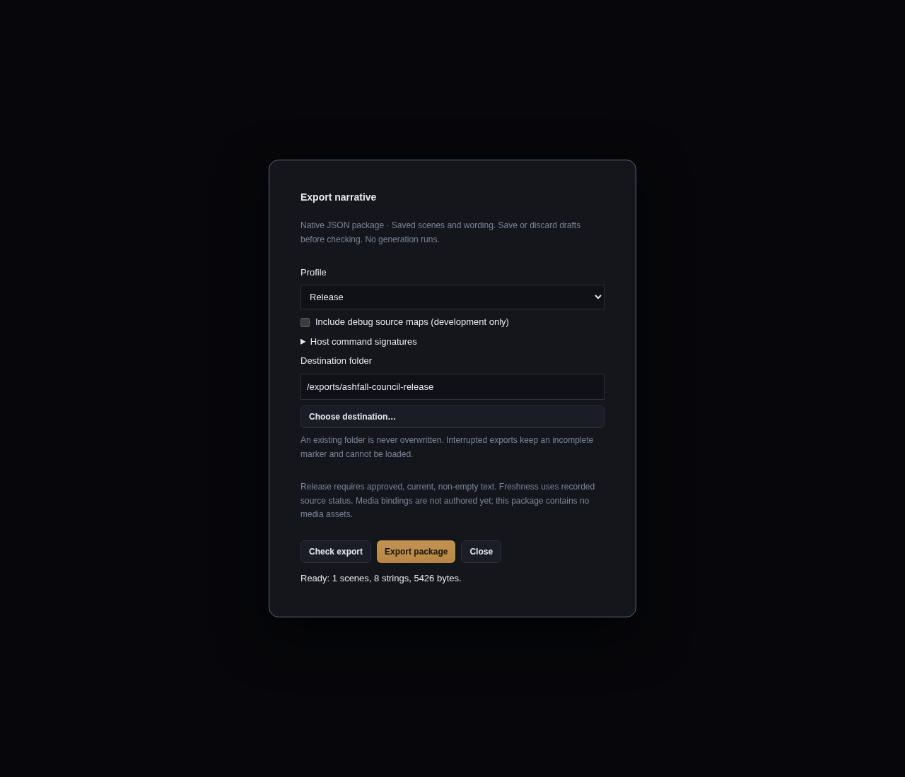

# Native narrative packages

**Narrative → Export…** writes version 1 of Wobu's native JSON package. It consumes saved scenes
and recorded accepted text without generation. This is N2 issue #160; no N5 engine adapters,
cross-language conformance suite or Yarn exporter is included.

## Export a package

1. Save the intended scenes, wording and variable declarations. Unsaved drafts are not exported.
2. Open **Export…**, choose **Development** or **Release**, and optionally include development
   debug source maps. Release disables debug maps and rejects empty/unapproved/out-of-date text.
3. Declare any host command argument signatures used by the story. Export validates registration
   and argument domains; it never executes these commands.
4. Choose a new destination folder outside the project, then **Check export**. The report shows
   blockers/warnings and runtime scene, string and byte counts.
5. Select **Export package**. Wobu captures and validates saved source again, and requires its
   deterministic payload identity to equal the checked identity. A changed payload requires a new
   check. Existing destinations are never overwritten or merged.

Development can export missing draft text with compiler warnings. Playing an uncovered dialogue
slot still yields the runtime's explicit no-match error. Release verifies canonical editorial
receipts against exact scene/beat/slot/variant identity, speaker, wording revision and current
review context. Writable Approved/Current flags alone cannot authorize a release; missing or
mismatched history blocks it. Review context still uses a conservative authored projection, which invalidates more lines than
the [dependency index](35-narrative-dependencies.md) (#168) does; the two are separate answers and
release validation reads the conservative one. See [review evidence](26-narrative-review.md).
The source model does not yet contain production media bindings, so current exports contain no
media assets.

The export dialog below is a Chromium render of the actual React component, using explicit mock
IPC validation data. It is browser evidence, not native Tauri or filesystem export evidence.



## Version 1 layout

```text
manifest.json
state.json
graph.json
strings/en.json
media.json
debug/source-map.json  # optional, development only
```

The manifest has `format: "wobu-narrative"`, package `version: 1`, `graph_version: 1`, a profile,
base `locale: "en"`, required capabilities, file byte sizes/content hashes and `payload_hash`.
Version 1 requires exactly `deterministic_graph: 1` and `separate_strings: 1`, plus
`supporting_text: 1` when and only when the graph contains supporting text assets (#167). The
declaration is compared against the payload after the graph is parsed, so a manifest that claims
supporting text and ships none — or the reverse — is rejected rather than silently dropping every
bark. A package without supporting text declares exactly the capabilities it always did and keeps
its existing identity. Missing/unknown required capabilities or unsupported versions are rejected. The base locale identifies the table;
Wobu does not detect or translate its wording. Additional localisation tables remain #178.

`state.json` holds the declared typed domains, defaults and ownership. `graph.json` holds the
compiler graph with empty state/source-map fields and empty inline choice/dialogue text fields.
The reader supplies the separate schema and strings to reconstruct the runtime graph. Text is
keyed by the original stable variant ID or choice ID, and supporting text uses that same table and
the same variant identities rather than a second one. Dialogue strings also carry their wording
revision hash; they contain no prompts, generation receipts or approval records. Changing wording
changes its content hash without renaming its string ID. Dialogue is data and cannot inject logic.

`media.json` is an empty object in v1. Non-empty bindings are explicitly rejected, rather than
silently copying unreferenced project media or pretending unsupported references were packaged.
A later media capability must define bindings, file validation and production gates together.
Development debug maps contain only stable source element IDs. Release contains no debug map,
authored summaries, intent, epistemic context, provider configuration, source paths or timestamps.

Every graph scene is an explicit entry candidate, so all compiled scenes are retained. Only the
choice/variant strings they reference are included. The reader rejects missing/unreferenced
strings, duplicated IDs, dangling graph targets, malformed schemas and invalid command signatures.
Existing generation images, model files and other project assets are not copied by this format.

## Identity and loading limits

The package crate serializes compact JSON with sorted maps and source-order dialogue/branch lists.
Each file hash is lowercase BLAKE3 over its exact bytes. `payload_hash` is BLAKE3 over the canonical
JSON serialization of the sorted `files` record map. Publication destination, date and job/run ID
are absent from payload identity. Optional debug maps intentionally change package identity.
Runtime snapshots bind to the reconstructed graph's hash; this package format does not promise
compatibility with an existing Preview snapshot or cross-language save representation.

`wobu_narrative_package::read(path)` is the validating entry point. It rejects unknown JSON fields,
duplicate object keys, fractional/exponential numbers, unsupported versions/capabilities and
content size/hash mismatches before exposing a graph. Schema/graph integers use Rust signed 64-bit
values; consumers must preserve them exactly. This package path does not route graph numbers
through JavaScript. The webview receives only bounded counts, messages and identity strings.

| Limit | Version 1 |
| --- | --- |
| Manifest bytes | 64 KiB |
| Bytes per payload file | 32 MiB |
| Total payload bytes | 128 MiB |
| Strings | 100,000 |
| Bytes per string | 1 MiB UTF-8 |
| JSON nesting | serde_json's default recursion limit (128) |
| Payload paths | Four required fixed paths and one optional development path |

File metadata is checked before reading and reads are capped to the declared size plus one byte,
so a file growing during reading fails its limit/hash checks. Payload paths use portable lowercase
ASCII components: absolute paths, traversal, empty components, separators from another platform
and aliases outside the fixed allow-list are rejected. Existing symlinks in the package or its
ancestor path are refused. This is not a signed distribution format; the host owns distribution
trust and protection against a hostile process replacing files concurrently with reads.

## Snapshot and publication boundary

The app reconciles project discovery, reads scene documents and state into memory under its project
lock, then verifies scene/state stamps, runtime character identities read from actual entity files,
and the aggregate narrative source fingerprint. Detected concurrent edits abort before export.
Compilation and packaging use only these immutable values, and publication runs on a blocking
worker after releasing the project lock. Later source edits cannot change the captured output.
Filesystem writers outside Wobu do not share its mutex; the validation is optimistic, not an OS
filesystem snapshot or a lock imposed on external editors.

Publication exclusively creates the destination directory, writes `.incomplete`, creates and flushes
payload files, flushes their containing directories, and writes the manifest last. It removes the
marker only after the complete payload and manifest have been flushed. On Unix, directory entries
are flushed as well; Windows uses file flushes because opening directories as ordinary files is
not portable. Hardware/power-loss guarantees therefore depend on the platform/filesystem.

Interrupted work remains visibly incomplete: a marker or missing manifest prevents the validating
reader from loading it. The exporter does not delete a failed destination and never overwrites it
on retry; inspect/remove it deliberately or choose a new folder. If the final directory flush fails,
the exporter tries to restore the marker and reports failure. A disconnected disk can prevent even
that recovery write, so consumers must always verify manifest contents and hashes.

## Verification

Rust tests pin a fixed-ID Unicode manifest golden, compare reproducible payloads, round-trip graphs,
reject unknown versions/capabilities, duplicate/missing strings, corruption, traversal, oversized
metadata and symlink paths. Publication fault injection stops before the manifest and verifies
incomplete detection and no-overwrite retry behavior. Command tests check development/release
blockers and concurrent scene/state changes without mutating project canon.

React tests verify profile controls, validation blockers, destination requirements, checked-identity
publication and visible errors. Those tests mock IPC; they do not establish native Tauri rendering
or real filesystem publication.

A separate Linux Tauri/WebKit check used the handwritten project from the
[native Preview walkthrough](21-native-narrative-preview.md), real Rust IPC and a new destination
outside the project. Development export with `{"file_record":[]}` and debug maps wrote two scenes,
four strings and five payload files (3,896 bytes) plus the manifest. The
[success screenshot](screenshots/narrative-export-native.png) shows payload identity
`442d76f525538fd1783ba2e5ad1656996e2b0e764491cf5089c4c0ce4353ba72`.
The package reader also validated the published files and hashes. A second export to that folder was [refused](screenshots/narrative-export-existing-native.png).
Switching to Release [blocked publication](screenshots/narrative-export-release-blocked-native.png)
because the three handwritten dialogue variants were unapproved drafts. All 22 canonical file
hashes from the Preview audit remained unchanged. This native check establishes desktop export;
it does not claim engine integration or a voiced production package.

## Configured locales

[Revision-aware localisation](37-narrative-localisation.md) adds an optional `localisation: 1`
capability and `locales.json`. Release preflight checks configured locale approvals/freshness or an
explicit fallback policy and reports missing rows and fallback origins in Export. Source-only
packages retain their existing files and hashes. Locale payloads contain prepared text and formatting
forms; they contain no authoring receipts or provider calls. Rust reference lookup is implemented;
N5 engine adapters and their conformance remain excluded.
