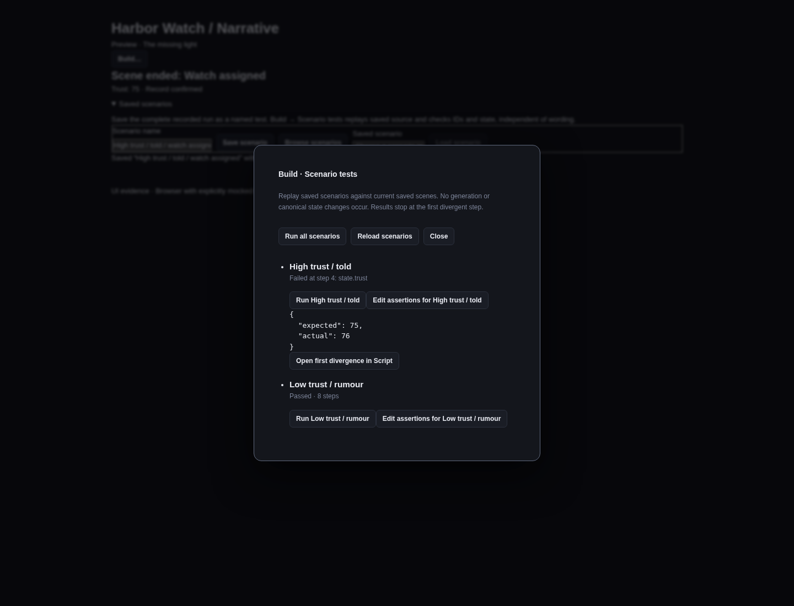

# Saved narrative scenarios

A scenario turns a Preview run into an offline regression test. In Preview, expand **Saved scenarios**,
enter a name and choose **Save scenario**. The file captures the run's starting values and command
signatures, its chosen responses, simulated host results, checkpoint operations and assertions at
each observed boundary. It saves stable scene, beat, slot, variant and choice IDs, state values and
the ending cursor. Dialogue wording, revisions and playthrough-specific command tokens are excluded.

**Browse scenarios** lists saved tests for the current scene. **Load scenario** restores that test's
starting inputs and command signatures and starts a new Preview against current saved source. It
does not automatically click through the recorded choices. Use **Build… → Scenario tests** to replay
the complete test or every saved test. Tests run one at a time, and **Stop after current scenario**
prevents subsequent runs. No provider, game host or generation job is invoked.

A failure shows the first divergent step, checked field, expected value and actual value, with a link
to Script. For state mismatches the runner links the effect that last touched that variable when
available; otherwise it links the last observed decision or current cursor. Compile errors also link
to their scene. Result step numbers in the UI start at one; the Rust API uses zero-based indices,
where step zero is the initial yield. Results describe the last run; run again after editing source.



## Portable canonical source

Scenario records live at `narrative/scenarios/<ULID>.json` in the project. The storage envelope owns
`schema_version`, stable `id`, `kind: "scenario"`, `name` and `payload`. The payload's independent
`version: 1` describes the scenario language, not the storage envelope. Both versions are validated;
unknown fields and unsupported versions are rejected. The payload contains:

- `scene`: stable entry scene ID.
- `initial_state`: narrative overrides and required host values at initialization.
- `seed`: preserved for a future explicitly versioned selection policy; current selection remains
  authored first-match.
- `commands`: the frozen command argument registry used to compile the run. Compiling saved source
  checks the whole project, so this registry must cover every command referenced by its scenes.
- `steps`: an initial assertion, then `advance`, `choose`, `complete_command`, `save_checkpoint` or
  `restore_checkpoint` actions with their expected boundaries and state.

The runtime resolves the currently pending command token during replay. A checkpoint contains an
in-memory runtime snapshot belonging to that replay; restoring it does not reapply earlier effects.
Explicit failed and cancelled command responses can be asserted and retried. Scenario files never
embed executable code, provider prompts, runtime snapshots or external host operations.

Saving a scenario creates a new named record. **Edit assertions** in Build edits an existing record
using its original source stamp. A conflicting writer is preserved, the edit remains visible, and
the writer must reload before retrying. Invalid or future source is never overwritten. The editor
sends raw JSON to Rust for strict parsing, so JavaScript cannot silently round authored numbers before
validation. Desktop values and seeds must fit the exact JavaScript integer range; the pure Rust API
retains the wider integer support of the reference runtime.

## Partial assertions

The **Edit assertions** action exposes the portable JSON payload. Omit a boundary field to leave it
unconstrained, omit `boundary` to assert only state, or provide an empty `state` object to ignore state.
Supplied state is a subset comparison, never an assignment. A supplied choice `ids` array checks the
complete available choice list in authored order; omitting it checks only that a Choices yield exists.
An end assertion may check its stable scene and beat, without depending on the authored ending label.
For example, a valid initial partial assertion is:

```json
{
  "action": null,
  "expect": {
    "boundary": { "kind": "line" },
    "state": { "trust": 70 }
  }
}
```

Only the initial step has `action: null`. Unexpected runtime errors fail a test even when every
boundary field is unconstrained. An intentional failed/cancelled host result uses `expect.error` of
`command_failed` or `command_cancelled`; other execution errors remain failures.

Preview keeps a separate complete capture tape from its shorter, scrollable decision history.
At most 1,000 steps can be saved. Exceeding this marks the tape incomplete and disables Save scenario
with an explicit message; it never discards early actions and pretends the remainder is complete.
The runner also rejects oversized tapes and bounds each automatic action to 1,000 internal steps.
Scenarios may end at a partial boundary, including a pending command; reaching End is not mandatory.

## Headless API and original fixture

The pure `wobu-narrative-scenarios` crate exposes `run(&Graph, &Scenario) -> Result<RunReport, Invalid>`.
It has no filesystem, network, Tauri or provider dependency. The caller supplies validated compiled
content. `RunReport` returns success or a first `Divergence` with the exact checked field, source IDs,
expected/actual data and the runtime's actual decision/effect trace. Running does not mutate the
supplied graph, scenario, project world or narrative state files.

The original [Harbor Watch fixture](../examples/narrative/harbor-watch/README.md) contains six tests:
low/high trust crossed with witnessed/told/rumour knowledge. It includes distinct attributed dialogue,
a choice requiring high trust, state consequences, a pending command checkpoint, a failed simulated
host response, restore and successful completion. The fixture's expected IDs and values are authored
explicitly rather than generated by replaying the implementation under test.

Run the suite offline from `src-tauri`:

```sh
cargo test -p wobu-narrative-scenarios
cargo test -p wobu narrative_scenarios
```

The regression test deliberately changes a +5 consequence to +6 and expects the first failure at
step index 3, `state.trust`, expected 25 versus actual 26, with the changed choice's source identity.
It then restores the original graph and requires the scenario to pass. Other tests cover wording-only
edits, partial assertions, invalid schemas, missing host state, unavailable choices, checkpoint misuse,
conflicting saves, transport integer bounds and canonical source remaining unchanged.

The screenshots in this guide and [Save scenario](evidence/narrative-162/save-scenario.png) were
captured in Chromium with **explicitly mocked IPC**, to inspect the real React controls and layout.
They are not native desktop or engine validation claims. Execution and persistence are verified by
the actual Rust fixture and bridge tests. The earlier native Preview walkthrough remains documented
in [the native guide](21-native-narrative-preview.md). No N5 adapters or conformance suite are included.
