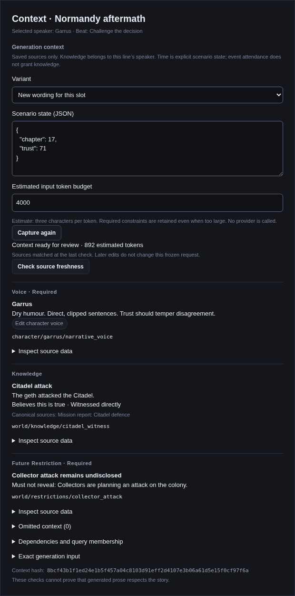

# Attributed narrative generation context

The Context inspector resolves a saved dialogue slot into an immutable, attributed request for
offline prose generation. It does not call a provider, enqueue work, write dialogue or change
runtime state. [Generation jobs](25-narrative-generation.md) create separate proposals; guarded editorial application
remains #165–#166. Supporting
text records are defined by the [narrative domain model](34-narrative-domain-model.md) and
authored through [supporting text](33-narrative-supporting-text.md); generating them remains #167
work. N5 engine integrations remain excluded.

## Inspect a line

1. Give characters a **Narrative voice** in their normal Attributes editor. This is the explicit
   `attributes.narrative_voice` text field, saved through the existing guarded character editor.
   Appearance descriptions, raw notes, image references and visual influence weights are not
   narrative voice or evidence of truth.
2. Author canonical facts and separate knowledge claims in World state. A claim says which
   character believes a fact, whether they consider it true/false/unknown, where the belief came
   from and when it applies. Add directed relationships, event facts and future restrictions.
3. Select a dialogue line in Script or Flow. In Context, choose an existing variant or new wording,
   supply complete scenario state and select an estimated input budget. Defaults populate the form;
   missing or out-of-domain variables block resolution. The desktop form accepts safe JavaScript
   integers only and sends the original JSON text to Rust for typed parsing before numeric
   spelling can be rounded; the pure resolver retains the Rust source model's full integer domain.
4. Select **Inspect generation request**. Read the knowledge perspective, sources, constraints and
   diagnostics. Expand source data or **Exact generation input** to inspect the canonical input.
5. **Check source freshness** compares the frozen request with the saved sources. An out-of-date
   result remains visible for comparison. **Capture again** makes a new snapshot; it does not
   replace generated or human-authored dialogue.

Changing form controls only affects the next capture. Unsaved editor text is not silently flushed
or included. The snapshot is retained while this selected inspector is mounted, not persisted as a
new canonical project record. Future jobs must retain the entire frozen envelope before queueing,
require `ready`, and revalidate dependencies before applying their results. This issue provides
that serializable input/freshness contract, not the job integration itself.

This screenshot runs the actual React inspector in Chromium with explicit mocked Tauri IPC.
It verifies browser rendering; it is not a native desktop or live provider test. Resolver tests and
command tests with temporary real project files establish the separate backend behavior.

## What the resolver includes

Knowledge belongs only to the selected slot's speaker. A witnessed assertion, something told by
another named character and a rumour retain their distinct provenance. False belief means the
speaker rejects the canonical assertion; unknown means they do not know whether it is true.
Neither rewrites the canonical fact. Another participant's knowledge is never automatically
inherited. Multiple active, disagreeing claims remain visible and block generation.

Scene/beat objective, participant roles, authored character voices, required meaning and forbidden
revelations have source addresses. Active future restrictions are required constraints; their facts
cannot also appear as usable knowledge. An invalid release condition fails closed. Missing fact,
participant or telling-source references are diagnostics, not invented replacements. The input
labels free-text context as authored data, not permission to change executable structure.

Conditions use the runtime's checked evaluator over the complete supplied scenario. There is no
wall clock, inferred event chronology, inferred acquisition or "most recent" heuristic. Authors
encode chapter/time windows in declared variables and conditions. An event summary enters context
only when applicable and all of its referenced facts are known true and unrestricted for the
speaker; attending an event does not manufacture knowledge. Relationships are directed from the
speaker to scene participants.

Scene entry and selected variant conditions must hold. An earlier matching variant blocks a later
shadowed selection. These are local applicability checks, not a proof that a full game playthrough
can reach the selected beat. Wider reachability analysis remains #170/#171.

## Bounded input and attribution

`wobu-narrative-context` is pure: immutable scene/world/schema/character inputs produce a
`FrozenContext` version 1. It reuses `wobu-influence::Chars` for its explicitly approximate
three-characters-per-token budget, never the art system's visual priorities or weighting.
The estimate covers the complete provider-neutral request, including instructions and attribution.
Provider adapters report actual usage when available. Preflight estimates remain heuristic and do not
guarantee that a request fits a particular model's context window; output has its own explicit limit.

Required fragments are never removed. If they alone exceed the estimate, the complete required
request is retained with a blocking overflow diagnostic. Optional existing wording, knowledge,
relationships and events are considered in deterministic authored order; whole fragments are
omitted with source addresses when they do not fit. There is no hidden string slicing. The complete
scenario is retained in the frozen envelope for replay and validation; it is not sent in the
provider-neutral request, because the context fragments already reflect evaluated conditions.

Direct dependencies map source addresses to content hashes, including a hash of null for missing
lookups. Queries record their filters and candidate membership before condition evaluation, even
when membership is empty or every candidate is inactive/omitted. This captures additions,
deletions and changes that a list of included facts alone would miss. Scene/schema dependencies
are currently conservative whole-source hashes; future incremental builds can narrow their
addresses without changing the requirement to track query membership.

The desktop bridge reconciles, captures saved scene/state/world plus referenced characters, and
verifies each actual read stamp again under the project lock before returning the immutable result.
An aggregate narrative fingerprint detects source membership changes. These are optimistic file
checks, not an OS-wide filesystem transaction against arbitrary external writers. Freshness is a
content/dependency comparison, not a signature or proof of authorship. A save to an unrelated
nonqueried world record need not make this context stale.

Checks expose structural contradictions and missing sources. They cannot prove semantic prose
correctness, interpret an arbitrary rumour's external reference or guarantee an LLM obeys a
forbidden-revelation instruction. Human review remains necessary.

## Verification

Semantic fixtures cover the three knowledge perspectives, false/unknown and contradictory beliefs,
future restrictions, missing fact/telling sources, explicit acquisition state, inaccessible variants,
context overflow/truncation, empty/inactive query membership and deterministic frozen attribution.
Bridge tests exercise saved-source drift and mutation during capture. Frontend tests verify
inspection, retained stale requests, visible blockers/omissions, safe-number rejection and errors.
