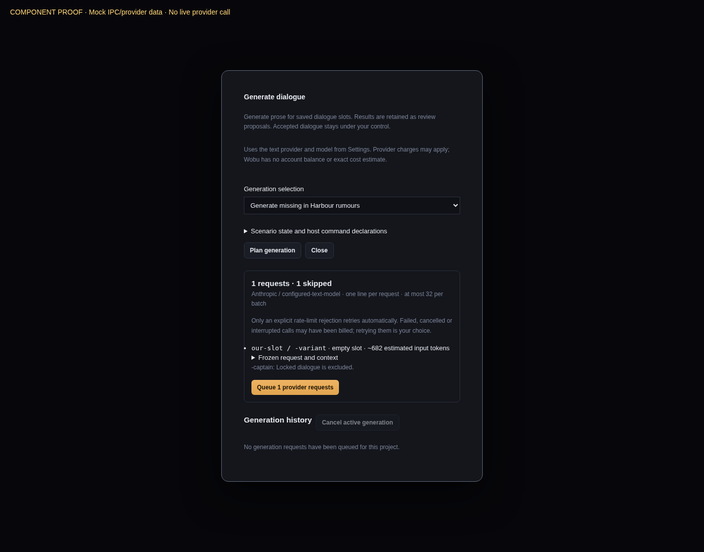
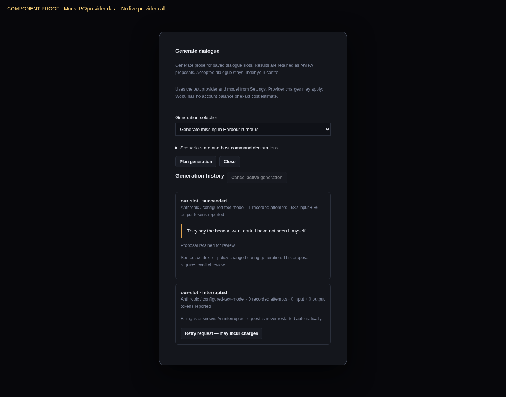

# Narrative generation jobs

Open a scene, choose **Generate…**, then select **Generate missing** or an existing dialogue
variant. Planning reads saved source, validates it with the development compiler, and captures
attributed narrative context. Save pending editor changes first. An empty slot reserves one
stable candidate variant identity; a populated slot requires selecting an authored variant.
Generation cannot add choices, effects, conditions, speakers, or branches.

The plan shows the configured text provider/model, individual line requests, estimated context
tokens, and skipped locks or blocked context. The optional state/command JSON fields declare
the scenario used for context resolution and the compiler's registered host commands. Defaults
come from the authored state schema. Both inputs retain their raw numeric spelling until Rust
validates them. A batch contains at most 32 line requests; narrow larger selections.

**Queue provider requests** explicitly starts paid work. No request starts while merely planning.
Anthropic and Gemini use the existing text-provider credentials and streaming transports, with
an explicit structured-output capability. Credentials remain in machine-local credential storage
and process memory. Requests and receipts contain provider/model selection but no credential,
provider URL, or provider error body. The UI reports request counts and reported token usage;
it does not invent account balances or exact prices.

## Frozen inputs and strict output

`wobu-narrative-generation` is a portable, provider-free contract crate. `FrozenRequest` records
request/batch IDs, exact source selection and candidate identity, speaker, scene content hash,
compiled graph hash, text revision, slot and variant policies, complete `FrozenContext`
(including dependency hashes and query membership), provider/model/settings, and the exact
versioned system prompt, prompt and output schema. Context includes only the resolver's
attributed narrative inputs. It is not the visual influence stack.

Each response must be one JSON object containing exactly one `lines` entry with `slot_id`,
`variant_id`, `speaker`, and `text`. Unknown fields, duplicate keys/lines, missing fields,
changed identities, incomplete streams, blank text, control characters, and text over 4,000
characters are rejected. Accepted response bytes are bounded to 64,000 bytes. Executable fields
cannot be deserialized into a candidate. Dialogue remains inert prose: this validates shape
and identity, not literary quality or the truth of every sentence. Human review remains needed.

## Publication and recovery

Before queue submission, each frozen request becomes an immutable canonical receipt. Every
completed provider attempt then receives its own immutable receipt, with usage, a stable
failure code, and billing uncertainty. Only fully validated successful raw output and its
typed candidate are retained; malformed provider bodies and partial streams are discarded.

A successful attempt receipt is persisted **before** its proposal publication. The result's
receipt and proposal become visible together through the canonical publication manifest and
immutable objects described in [narrative storage](24-narrative-storage.md). Proposals include
the frozen expectations and fresh source/text/policy/context checks. Changes during a call
produce a proposal marked for conflict review. Slot and variant locks are checked both before
calling the provider and when publishing the result. After retaining the immutable result, the
shared editorial transaction can replace wording only when the slot and existing variant both
remain Generated; an empty Generated slot can receive its first wording. Edited content retains
a separate proposal, and a lock or changed input prevents automatic replacement. Generation never
grants approval or creates story logic. [Review](28-narrative-review-queue.md) compares retained
candidates and records explicit acceptance, approval, attestation and policy decisions through
the [same guarded storage boundary](26-narrative-review.md).

The Generation history lists live queue status and durable results. **Cancel request** and
**Cancel active generation** use the existing cancellation token and shutdown queue. Queued
work can be cancelled before a provider call; running streams are stopped through the adapter.
Only a known rate-limit rejection before any output/usage may retry automatically. Other
failures, partial streams, cancellation and uncertain billing require an explicit retry.
Successful requests cannot be implicitly retried, including after restarting Wobu.
Complete publications retain their successful receipt even if its redundant standalone file is
removed, so that removal cannot authorize another paid request.

An unfinished request intent appears as interrupted when no live queue job remains. It is
never automatically resumed: a crash may have occurred after the provider received the call.
If success was saved but proposal publication was interrupted, **Recover retained result**
finishes publication without a provider call. This operation is idempotent. Source hashes and
policies are rechecked against the retained request, and source edits remain intact.

Jobs capture the exact open-project ticket. Closing, reopening, replacing or disconnecting
that session prevents a late result from being committed through it. A forced shutdown or
session change may leave only the request intent; the UI explicitly treats its billing as
unknown. Frozen prompts preserve provenance; they do not promise provider determinism or
bit-for-bit reproducibility.

## Evidence

The following screenshots render the actual `NarrativeGeneration` React component using
explicitly mocked IPC/provider data. They demonstrate planning and recovery controls, **not**
a native desktop run or a live provider request. No live-provider success is claimed here.

Verification covers strict contract rejection, malformed/logic-injected output, immutable
request and attempt receipts, partial batch retry, rate-limit versus partial-stream retry,
shutdown cancellation, concurrent edits/locks, and successful-result publication recovery.
The provider adapters additionally run local HTTP streaming fixtures against their real
transport implementations. UI tests cover explicit planning/queueing, raw integer spelling,
per-item retry, cancellation scope, recovery without a provider call, and read-only history.

N5 engine adapters and cross-language conformance remain excluded.
