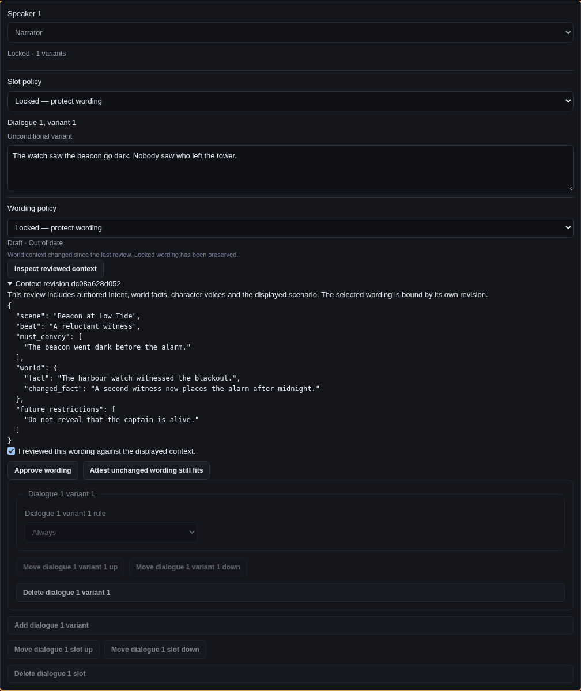

# Narrative wording review

Script now reviews saved dialogue through the same Rust storage boundary as the project Review
queue. A provider key is unnecessary: authored wording can be reviewed, approved and locked without
running generation. Save or discard the Script draft first; a decision always refers to the saved
scene and the exact context displayed for that decision.

The screenshot uses the actual Script component in Chromium with mocked IPC and authored example
records. It demonstrates the controls and layout, not a native backend or live provider call.

## A writer's workflow

1. Set **Slot policy** and **Wording policy** independently. Use Edited to retain human control,
   Generated to permit replacement, and Locked to protect the slot or wording. Changing a Locked
   selector to Edited or Generated is an explicit unlock recorded in history.
2. Choose **Inspect reviewed context**. Read the authored intent, world records, character voices,
   scenario and restrictions. A missing character or invalid world condition must be repaired before
   an approval can be recorded.
3. Acknowledge the displayed wording and context, then choose **Approve wording**. Approval records
   both revisions. It does not require a generation request or a provider account.
4. If upstream context changes, the effective badges become **Draft · Out of date**, including for
   Locked wording. The original text and its protection remain intact. **Attest unchanged wording
   still fits** records a new context decision for unchanged previously reviewed wording; it preserves
   whether that wording had been approved. Use Approve for new or never-reviewed wording.
5. Inspect a generated proposal beside the current words and accept or reject it explicitly. An
   outdated proposal cannot be silently rebased by refreshing its UI guard. Use an explicit manual
   edit if its words are still useful, then review the resulting wording separately.

| Slot policy | Wording policy | Completed generation |
| --- | --- | --- |
| Generated | Generated, or a still-empty slot | Replace only if all original guards still match; resulting wording is Draft |
| Edited | Generated or Edited | Retain a separate proposal |
| Generated | Edited | Retain a separate proposal |
| Locked | Any | Do not submit or replace |
| Any | Locked | Do not submit or replace |

Accepting an edited candidate keeps the immutable provider candidate and records the human wording
as Edited. Accepting a proposal is not approval. Rejecting, locking and unlocking change no wording.

## Canonical decisions and review context

`ReviewContext` version 1 is independent of generation's frozen request/context version. Its
conservative projection includes the scene's authored structure and other wording, the world
records, variable declarations, captured character names/voices and the exact scenario. It excludes
`editorial_head`, slot policies, text lifecycle flags, and the selected wording's body/revision/
provenance. That selected wording is bound separately by scene, beat, slot, variant, speaker and text
revision. Consequently, approval and lock operations cannot invalidate themselves, while changes to
intent, speakers, conditions or upstream world content invalidate the relevant proof. Field-level
precision and incremental rebuild reporting remain #168 work; the current full world projection
can intentionally invalidate more lines than a future dependency index.

Each decision is an immutable `narrative_editorial` payload in the existing Receipt envelope. The
scene's `editorial_head` selects its committed chain. Events retain the previous and resulting scene,
actor, operation, context, active bindings and proposal decisions. Readers verify receipt identity,
chain continuity, context reconstruction and exact text/target binding. An unreachable receipt left
by interruption is not a committed decision. Missing or altered reachable receipts make approval
unverifiable. SQLite is never the approval authority; reopening or rebuilding the index does not
change a verified decision.

Source, Script, Flow, repair and ordinary save paths cannot mint approvals or switch editorial heads.
Manual wording begins Edited or Locked. A manual save records an unapproved context baseline:
new wording is Draft/Current, and later context changes can make it Draft/Out of date without
confusing freshness with approval. Several edited lines share one captured environment in their
receipt; each line retains its own exact target/context hash. A manual edit is resealed as human wording, becomes Draft,
and drops the old binding. Duplicating a scene/beat/line gives it new identities and Draft approval;
a Locked copy retains protection. Existing project files remain readable: legacy `approved` flags
without valid history are displayed as unverified rather than trusted or silently rewritten.

## Conflicts, undo and export

Review uses the original scene stamp, editorial head, context revision and typed scenario. A
nonblocking OS advisory lock coordinates cooperating writers; the final commit rechecks captured
canonical inputs. A changed source or protection rejects the decision without replacing current
wording. Arbitrary external editors do not participate in that lock, so their changes are detected
by canonical reads and rechecks rather than an assertion that the filesystem is a distributed
transaction system. Lock files are local `.wobu` metadata, outside narrative source and exports.

A lost successful IPC reply is not an instruction to retry with a fresh guard: repeating its original
request conflicts. Refresh to inspect the committed history. Scene undo uses expected-document CAS,
retains a conflicting entry for comparison, and never restores an old approval binding. Coalesced
text edits compare the two endpoints of the complete typing run. Existing normal source conflicts
still retain the incoming draft in a conflict sibling.

Release compilation requires explicit verified review evidence supplied by the host. Mutable
`Approved`/`Current` flags alone never satisfy the pure compiler. The compiler and game runtime still
perform no filesystem or provider calls. Development compilation reports unverified wording as a
warning; release export blocks it. Review state enters the desktop bridge as raw `state_json` so
Rust validates integers before JavaScript can round them, and unsafe numeric values in displayed
context are rejected at the IPC boundary.

Completed generation manifests own their exact immutable receipt/proposal pair. Review lists those
published objects, not hypothetical standalone proposal files. Generation history also reads
completed publication receipts if a redundant standalone attempt file has been removed; that loss
cannot authorize another paid request. Incomplete publications and orphan objects never become
successful reviewed candidates.

This implements #165's lifecycle/domain and Script controls. Project queue, paging, diffs and grouped
bulk decisions are #166's companion surface. Production dependency records, field-level freshness
and engine integrations are separate work; N5 remains explicitly excluded.
