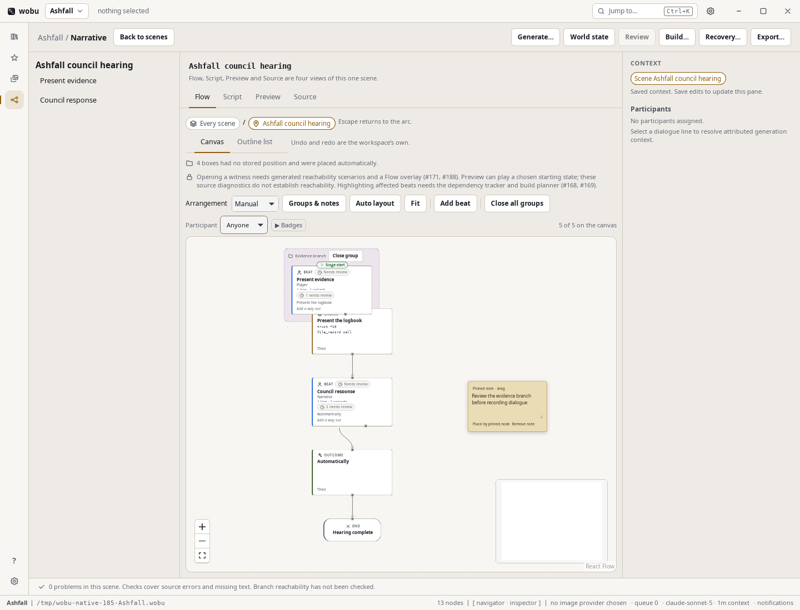
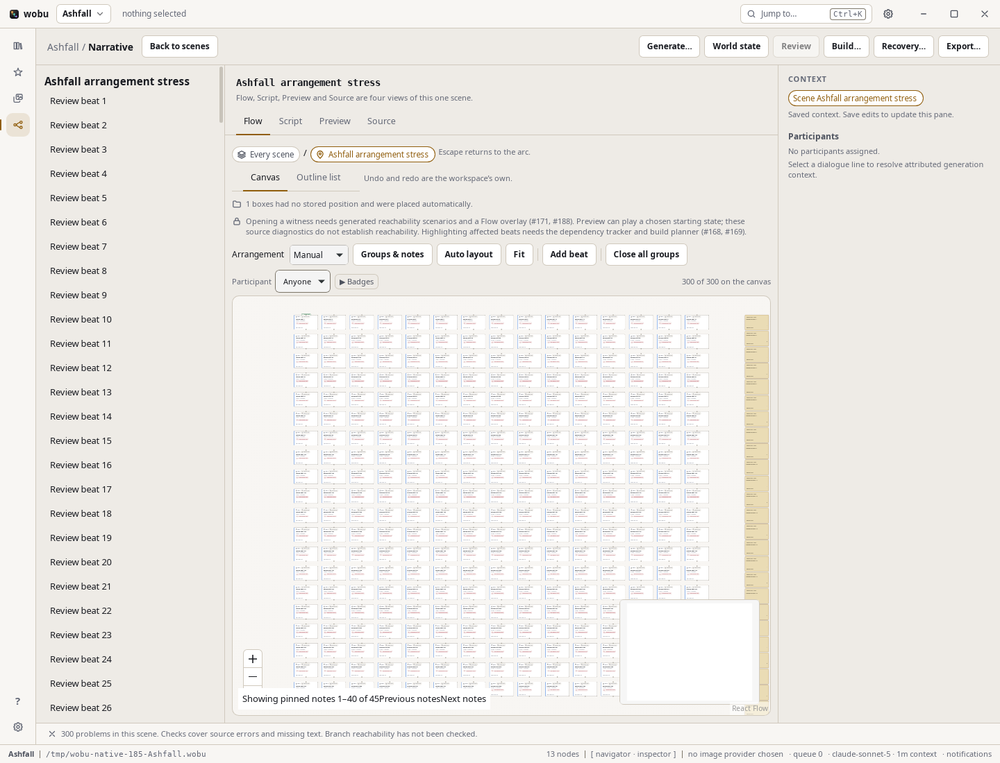

# Shared narrative arrangements

Flow stores arrangements separately from story source. A writer can move a beat, group an evidence
branch, collapse it, or leave a pinned note without changing dialogue revisions, review evidence,
context dependencies, compiled graphs or release package bytes. No runtime or engine needs these files.

## Authoring

Open Narrative → Flow. **Flow scope** selects every scene or a World quest. Quest membership comes
from World; this selector does not edit it. Double-click a scene to arrange its beats and choices.

**Arrangement** switches between Automatic and Manual. Automatic uses the background ELK worker as
the graph changes; switching back restores the saved manual coordinates. Dragging a story node makes
its arrangement manual and saves only that node's move. **Auto layout** in manual mode arranges once
and records the resulting positions. Newly added nodes always receive a seed position.

Select a node and open **Groups & notes** to create a named group or assign the selected node to an
existing group. Groups can be renamed, opened, closed and removed. Membership and collapsed state
are shared presentation data, independent of semantic quest membership. The group list is paged in
sets of 40, so every saved group remains reachable.

**Add pinned note** places a note near the viewport centre, optionally anchored to the selected
stable node ID. Edit its text and leave the field to save, drag its handle to move it, or use
**Place by pinned node**. Deleting the source node detaches the note and retains its words. These are
margin notes for writers; they never become dialogue, localisation strings or game assets.

A failed arrangement write keeps the visible draft and shows **Retry arrangement save**. This queue
is separate from source saves and undo. A read-only project can browse groups and notes but cannot
change shared presentation. Viewport, zoom, selection, inspector state and active panels remain
machine-local session state; they are never sent to peers or written into these sidecars.

## Portable schema

| File | Identity |
| --- | --- |
| `narrative/layout/scenes/<SceneId>.json` | Stable scene ID; positions use `beat:`, `choice:` and `outcome:` IDs. |
| `narrative/layout/quests/<EntityId>.json` | The quest's actual World ID; positions use `scene:` IDs. |
| `narrative/layout/arcs/<slug>.json` | Legacy arc key; `project.json` is the every-scene arrangement. |

Version 2 has a tagged `graph`, `mode`, `modeUpdatedAt`, `nodes`, `groups`, `annotations`, and optional
`removedGroups` / `removedAnnotations` timestamp maps. Group and annotation maps use minted ULIDs.
Each mutable entry has `updatedAt`. Note geometry can include width and height; the current editor
moves notes and edits their words. It does not author arbitrary canvas shapes.

Version 1 remains readable without rewriting files on open. The next explicit save writes version 2.
A newer version is reported as unavailable, receives an automatic fallback, and cannot be downgraded
by a local edit or incoming peer record. Unknown fields and invalid geometry also produce a visible,
non-blocking notice. A recoverable malformed JSON file is preserved as a content-addressed
`.corrupt-<hash>.json` sibling before an explicit save replaces it. Oversized or non-UTF-8 files are
left untouched and require filesystem repair; source editing continues.

Names and source ordering are not layout keys. Renaming or reordering a scene/beat retains positions;
a duplicate has fresh IDs and gets seed positions. Loading prunes missing IDs in memory and reports
stale/unplaced nodes; opening alone never writes. Group membership and note anchors are reconciled
even when the removed node had no explicit saved position. A subsequent arrangement save collects
stale coordinates. Deleting a scene also collects its sidecar. A successful guarded World save
collects sidecars for quests removed from its known previous revision. Cleanup is best effort and
cannot fail that canonical save; unsafe paths remain untouched. Stale/conflicting saves do not
remove arrangements. Opening or receiving an incomplete project never sweeps missing quests.

## Merge and transport

Entries merge independently by `(updatedAt, content hash)`. Equal timestamps therefore converge in
both directions. Mode uses the same deterministic tie break. Groups and notes merge as whole
entries: simultaneous edits to the same note can retain only one wording. These notes are cosmetic;
canonical dialogue uses the guarded editorial path. Clock skew can favour the machine with the later
clock. This is intentionally a presentation policy, not a prose merge algorithm.

Version 2 deletion markers prevent old copies from resurrecting groups or notes. A deletion wins an
exact timestamp tie; a genuinely later edit can recreate an entry. Node positions merge by union,
with source-ID reconciliation collecting deleted nodes. File saves reread and remerge changed bytes,
including checking the current schema again, and defer after repeated races. Filesystems do not offer
a portable compare-and-swap rename: the final check-to-rename interval remains a possible lost-drag
window. It cannot authorize a semantic source overwrite.

Peers advertise optional `flow_layouts` support. Layout exchange happens **after** the existing node,
asset and canonical narrative exchange. An older peer or unsupported layout version produces a
separate arrangement notice in sync status; ordinary source sync still completes. Every transfer
checks project permissions, strict registered paths, content hashes, graph identity, versions and
limits. Concurrent moves of different nodes survive. An unreadable local sidecar can be recovered
from a supported incoming arrangement with the original bytes retained.

The canonical registry, compiler/context fingerprint and release exporter exclude the entire
`narrative/layout/` prefix. Layouts never enter narrative conflict/approval queues or SQLite's source
index. Watch and polling use a separate disposable observation hash. It includes malformed/future
bytes and removals, and settles after one notification. A bad symlink can prevent a layout manifest
from being shared, with a notice, but cannot mask later changes to unrelated valid paths in polling.
Every path component is checked for symlinks; layout IO does not follow them. Oversized observations
use bounded content plus size/mtime so a giant sidecar cannot allocate or hash an unbounded body.

## Bounds and evidence

A layout is limited to 2 MiB, 10,000 node entries, 1,000 groups, 1,000 notes and 10,000 markers per
deletion map. Coordinates must be finite and within ±10,000,000; note dimensions are 1–10,000. Group
labels have a 256-byte limit, note bodies 8,192 bytes. Peer exchanges allow 2,000 files and 64 MiB per
stream, with bounded frames. Unsupported arrangements are reported separately from source sync.

React Flow's actual store remains capped at 300 nodes, **including decorative group frames**. When
story nodes use the available budget, excess decorative frames are omitted; groups remain available
through their paged controls. Notes use a viewport overlay, with at most 40 rendered per page, and
never enter the React Flow node store. The existing focused-neighbourhood view keeps larger story
graphs navigable.

Automated coverage uses real project folders, copied folders, polling, symlink paths and actual
loopback peers. Frontend tests exercise group/note authoring, queued failures/retry, read-only controls,
quest selection and the actual React Flow store with 300 story elements and 1,000 stored notes.
The application-level invariance test approves a handwritten line through the real guarded review
API, saves a layout, and compares canonical source/receipt bytes, review validity/freshness, captured
context/dependencies, compiled graph and **Release** package files byte for byte.

## Native walkthrough — 8 September 2026

The screenshots use the real Linux Tauri App, WebKit and Rust IPC, with a disposable copy of the
handwritten [Ashfall Preview fixture](21-native-narrative-preview.md). A temporary bootstrap opened
that project and selected Narrative; it did not replace components or mock commands. A local,
read-only measurement hook reported canvas geometry and React Flow's actual store. Mouse clicks,
drags and typing used `xdotool` on Xvfb display 197 at 1440×1100. The temporary bootstrap and
measurement code were removed afterward. This capture predates the separately integrated Review
queue, so its disabled Review toolbar button is not evidence about the final review workflow.

The walkthrough moved a beat, assigned it to **Evidence branch**, created and edited a pinned note,
moved that note, collapsed the group, and reloaded the webview and project. The
[reopened view](evidence/narrative-185/reopened-native.png) restored the collapsed group and note;
its saved manual node coordinates remained intact. A subsequent
[quest view](evidence/narrative-185/quest-native.png) saved its scene move under the actual quest ID.
The [audit](evidence/narrative-185/native-audit.json) compares all 18 original canonical files before,
after, and after reopening: every hash matches. Layout JSON, local index and session metadata are
excluded from that source audit.

This run exposed and fixed a native sizing regression: a saved-scene pane's percentage-height
React Flow child measured zero despite its parent's minimum height. Compare the
[blank prior canvas](evidence/narrative-185/before-sizing-native.png) with the working view above.
The parent now fills the editor and the child is anchored to its actual containing block. The first
canvas mount also waits for the arrangement query to settle, so initial Fit uses saved geometry;
rejected or missing layouts still resolve to a usable fallback. Stored group collapse hydration runs
after resetting the scene's local selection store.

A separate stress setup then added a persisted 300-beat scene with three open groups and 45 notes.
The native probe measured **300 actual React Flow store nodes, zero extra decorative frames, 40
rendered note overlays, and a 604-pixel-high canvas**. The first-open viewport fitted the saved grid.
This establishes the cap and native geometry, not a frame-rate guarantee. Reproduce it by copying
[the scene JSON](evidence/narrative-185/stress-scene.json) to
`narrative/scenes/00000000000000000000000030.yaml` and
[the layout JSON](evidence/narrative-185/stress-layout.json) to
`narrative/layout/scenes/00000000000000000000000030.json` in a disposable project. JSON is valid YAML
source input. This structural fixture deliberately has no dialogue or authored exits and therefore
shows source diagnostics; the separate Release invariance test uses a valid, reviewed story.

The minimap is blank in these native captures; this walkthrough does not claim to validate that
existing Flow rendering feature. Neither engine playback nor Windows/macOS behavior was exercised.
