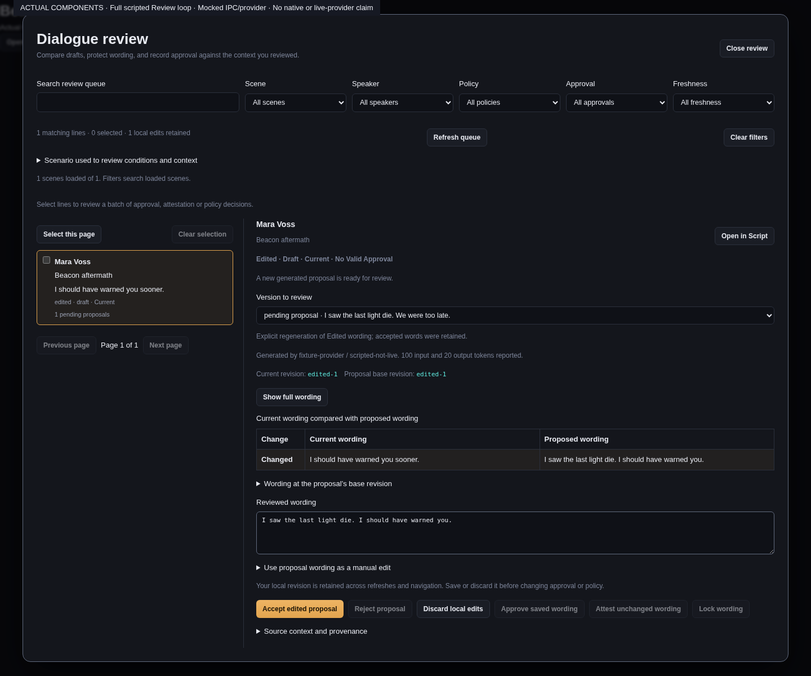
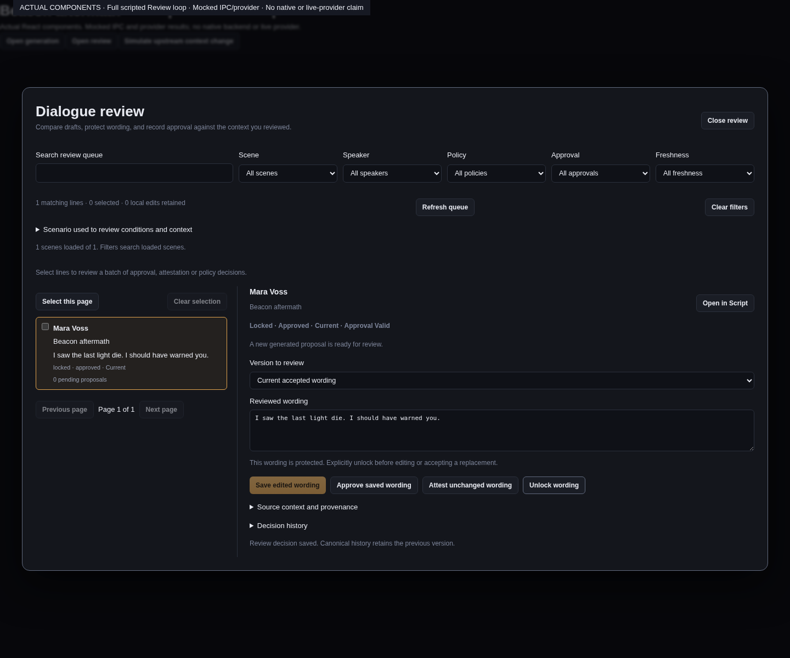

# Narrative review queue

The Review queue compares accepted wording, proposed wording and the revision used to request
that proposal. It keeps stable scene, beat, slot, variant and speaker identities visible. A proposal
is a candidate. Generation never automatically replaces Edited or Locked wording; Generated wording
can advance under its explicit generation policy.

Filter the project queue by scene, speaker, generation policy, approval and freshness, or search
wording and names. The queue displays 50 lines per page. Arrow Up and Arrow Down move between
lines; Tab reaches the comparison, controls and source links. Statuses use text as well as colour.

## Compare and edit

Choose a pending proposal to compare it with accepted wording. The base revision is always shown;
base wording is shown when it was retained in the generation request's bounded context. Source
context and provenance identify the request, immutable receipt, generation model and reviewed
context revision. Open in Script navigates to the exact variant.

Typing creates a local draft bound to the scene guard and context originally reviewed. Queue
refreshes, background jobs and navigating between lines do not replace that draft. Closing or
switching the project requires saving or explicitly discarding drafts. A concurrent source change
leaves your writing and the proposal available after a failed acceptance; it does not silently
renew the guard. Removed source lines retain their drafts in a recovery section for copying.

Accept proposal uses the original generated wording. Accept edited proposal submits the reviewed
wording as an explicit editorial change. Reject proposal records a separate decision; it does not
delete the immutable candidate. Approval and policy actions are disabled while that line has local
edits, so they cannot accidentally approve a different saved revision.

A stale proposal cannot be silently rebased. Inspect the current context and choose **Prepare manual
edit from this wording** to copy it into a separate current-wording draft. Then explicitly save the
manual edit. The original proposal remains pending until separately rejected. If another current
wording draft exists, save or discard it first; adoption never overwrites local writing.

## Protect and approve wording

Locking a slot protects every variant. A locked slot or variant blocks editing and accepting a
replacement; the UI offers an explicit unlock action. Approval applies to saved wording and the
reviewed context. Attesting unchanged wording records an explicit decision to keep existing prose
after reviewing the current context. Inspection alone does not approve or attest anything.

This UI uses the lifecycle and guarded transitions described in the narrative editorial lifecycle
contract. The backend remains authoritative for eligibility, source/context conflicts and policy.

## Verification

Component tests cover concurrent refresh and failed acceptance, original-guard retention, explicit
manual adoption, locked replacements, project-close draft protection, keyboard navigation, filtering
and pagination over 201 lines. The queue and Script use the same canonical editorial backend.

These screenshots show the actual React components with mocked project data and review callbacks.
They demonstrate the queue and retained edits after a simulated concurrent-source conflict; they are
not native Tauri or live-provider evidence.

## Project pages and batch decisions

Open **Narrative → Review**. Reads load 32 scenes at a time, with at most 10,000 dialogue rows in
one response. **Load more scenes** extends the queue; the loaded/total count states which scenes
the filters currently search. A changed scene catalog rejects the next page, so a collaborator
adding or deleting a scene cannot silently shift pagination. Unreadable files, oversized pages and
invalid scene context are reported explicitly; skipped scenes remain available through Source or
Script after repair.

Select lines, choose approve, attest, lock or unlock, then **Review selected decisions**. This is a
dry run against the original scene guards and context revisions. Counts distinguish eligible,
skipped and conflicting decisions. Any local draft for a selected line—including an unselected
proposal version—skips that line. A batch is limited to 128 decisions and reports extra selected
lines as skipped. Backend rejections appear conservatively as conflicting with their exact reason;
the UI does not infer policy eligibility by parsing error messages.

**Apply eligible decisions** submits only the requests found eligible in that plan. Each scene is
staged against its original snapshot and committed once. A conflicting scene does not prevent an
independent scene from succeeding; the resulting counts identify each outcome. Changes to selection,
operation, reviewed context or local drafts disable the frozen plan until another explicit review.
Nothing silently replaces the guard midway through a batch. Repeating an already committed request
fails its original guard, preserving canonical history.

## Full review-loop evidence

The [full browser recording](images/narrative-review-loop-mock.webm) exercises actual Generation and
Review components through scripted IPC: generate a line, save a human revision, regenerate while
retaining that revision, compare the candidate, accept edited wording, approve, lock, change upstream
context, and explicitly attest unchanged wording. The overlay labels mocked IPC and provider results
throughout. It is a component integration demonstration, not a native Tauri or paid-provider run.

Focused frontend tests cover that complete loop plus stale/conflicting acceptance, guarded manual
adoption, hidden drafts in bulk selection and disabled plans after a context change. Rust command
adapter tests use real project files to check dry-run immutability, same-scene grouped decisions,
independent conflicting outcomes, duplicate skipping, repeated-request rejection, bounded listing,
unreadable sources and catalog changes between pages. The shared editorial backend also tests real
frozen generation receipts and protected transitions; those tests do not call a live provider.
