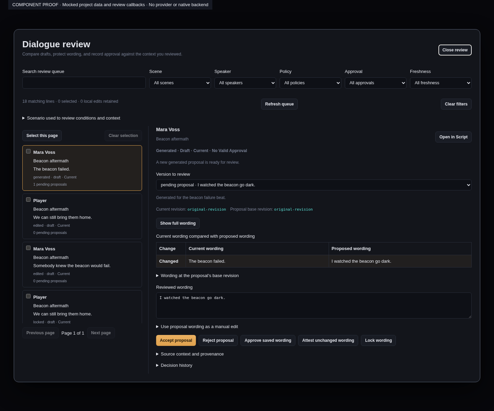
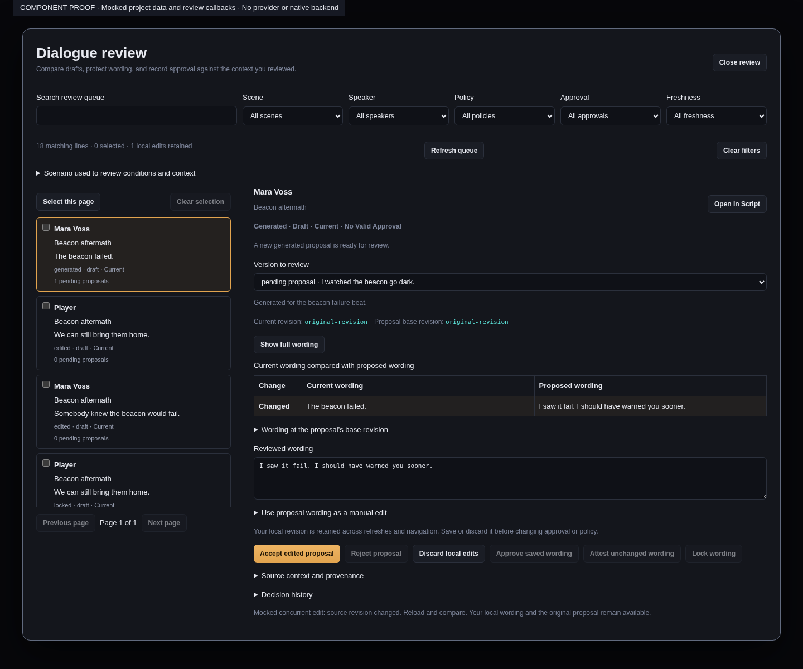

# Narrative review queue

The Review queue compares accepted wording, proposed wording and the revision used to request
that proposal. It keeps stable scene, beat, slot, variant and speaker identities visible. A proposal
is a candidate: generation does not replace accepted dialogue.

Filter the project queue by scene, speaker, generation policy, approval and freshness, or search
wording and names. The queue displays 50 lines per page. Arrow Up and Arrow Down move between
lines; Tab reaches the comparison, controls and source links. Statuses use text as well as colour.

## Compare and edit

Choose a pending proposal to compare it with accepted wording. The base revision is always shown;
base wording is shown when it was retained in the generation request's bounded context. Source
context and provenance identify the request, immutable receipt, generation model and reviewed
context revision. Open in Script navigates to the exact variant.

Typing creates a local draft bound to the scene guard and context originally reviewed. Queue
refreshes, background jobs and navigating between lines do not replace that draft. Closing or
switching the project requires saving or explicitly discarding drafts. A concurrent source change
leaves your writing and the proposal available after a failed acceptance; it does not silently
renew the guard. Removed source lines retain their drafts in a recovery section for copying.

Accept proposal uses the original generated wording. Accept edited proposal submits the reviewed
wording as an explicit editorial change. Reject proposal records a separate decision; it does not
delete the immutable candidate. Approval and policy actions are disabled while that line has local
edits, so they cannot accidentally approve a different saved revision.

A stale proposal cannot be silently rebased. Inspect the current context and choose **Prepare manual
edit from this wording** to copy it into a separate current-wording draft. Then explicitly save the
manual edit. The original proposal remains pending until separately rejected. If another current
wording draft exists, save or discard it first; adoption never overwrites local writing.

## Protect and approve wording

Locking a slot protects every variant. A locked slot or variant blocks editing and accepting a
replacement; the UI offers an explicit unlock action. Approval applies to saved wording and the
reviewed context. Attesting unchanged wording records an explicit decision to keep existing prose
after reviewing the current context. Inspection alone does not approve or attest anything.

This UI uses the lifecycle and guarded transitions described in the narrative editorial lifecycle
contract. The backend remains authoritative for eligibility, source/context conflicts and policy.

## Verification

Component tests cover concurrent refresh and failed acceptance, original-guard retention, explicit
manual adoption, locked replacements, project-close draft protection, keyboard navigation, filtering
and pagination over 201 lines. The queue is being integrated with the shared editorial backend;
bulk operations and end-to-end evidence are added with that integration.

These screenshots show the actual React components with mocked project data and review callbacks.
They demonstrate the queue and retained edits after a simulated concurrent-source conflict; they are
not native Tauri or live-provider evidence.

