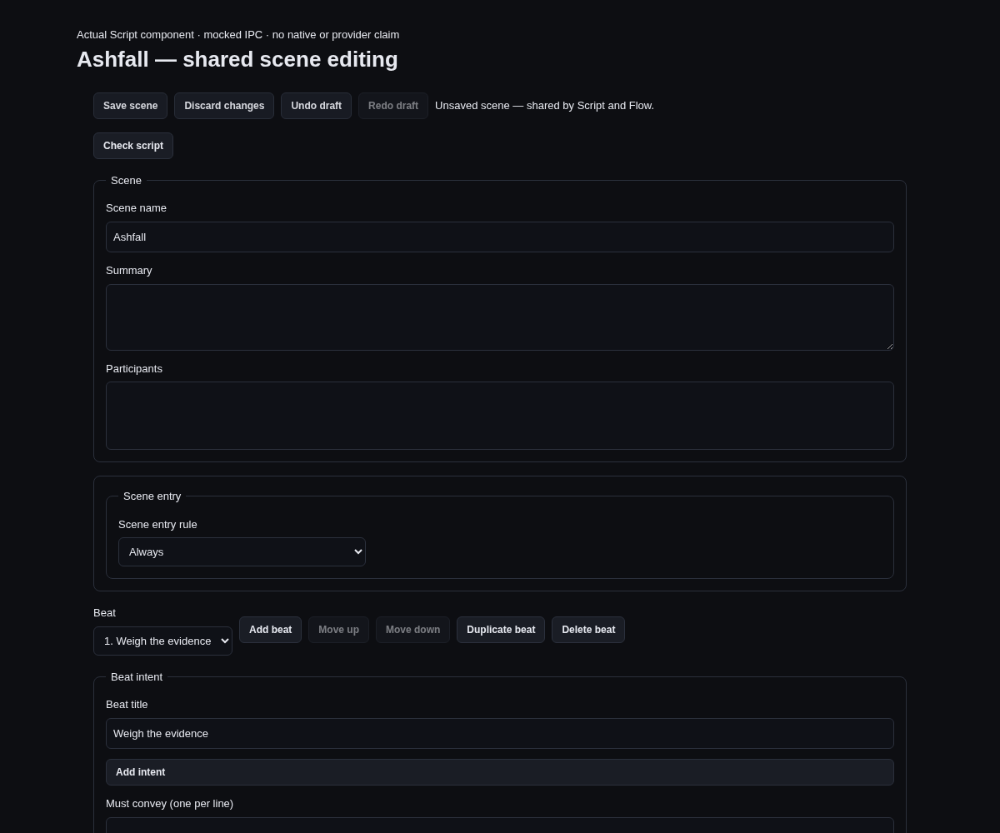

# Shared scene editing

Script uses a project-and-scene-scoped authoring session. **Save scene** saves the complete draft;
**Discard changes** returns to the latest loaded canonical source. Tabs, scene navigation and Back
to scenes do not save or discard it. The shared hook and controls are also the integration seam for
Flow and the outline; their consumer migration is required before claiming the complete cross-editor
workflow. Layout-only saves retain their separate persistence and do not save authored content.

The session keeps the original `SceneFile` as its write precondition. Incoming source is retained
separately and never silently becomes new authorization. A failed save keeps the complete draft and
any returned conflict path. Save disables authoring across remounts. A late response from a previous
project cannot populate the current scene cache, add current-project undo history, or clear another
draft revision. Such a completed save leaves its previous-project draft available for inspection.

Undo draft and Redo draft affect only memory. While a scene draft exists, workspace undo uses this
local history and never falls through to canonical writes, even at its beginning. History retains
at most 100 checkpoints and approximately 4 MiB of serialized UTF-16 content per direction. Earlier
steps may expire; a visible notice explains this, and the current draft and original source remain
intact. Typing in the same field within 750 ms coalesces; structural operations remain separate.
Each explicit successful Save adds one canonical edit through the existing guarded undo mechanism.

Source and Review cannot write this scene while its authoring draft exists. Review decisions retain
their own guarded lifecycle API; they never enter the authoring reducer. Save or discard authoring
changes before reviewing wording or changing policy.

Search and diagnostics use the existing latched reveal channel, extended with project, route,
variant and typed-field targets. A mounted Script editor waits until visible before revealing the
actual control. Repeated requests for the same target remain distinct. Target IDs are matched
against existing form markers rather than interpolated into CSS selectors.

## Checkpoint verification

Focused tests cover two actual shared-hook consumers combining prose and structure without writes,
one explicit save with canonical text preparation, local undo without canonical fallthrough,
bounded history, incoming-source/conflict retention, save pending across remounts, previous-project
responses, review refusal and hidden/repeated exact-target reveals. Script tests mount the real
component with explicitly mocked Tauri IPC. This checkpoint does not claim native keyboard evidence;
the integrated Flow/Script walkthrough remains part of #186/#194.

[Light-theme capture](evidence/narrative-edit-session/shared-script-light-mock.png). The temporary
browser host rendered the actual Script component and was removed after capture. Neither image
represents native Tauri execution or a live provider call.

## Declared variable history

Saving variables adds one canonical undo entry containing both complete declaration documents.
Undo and redo compare the expected authored declarations before using the current source stamp;
newer collaborator changes and invalid restored schemas are refused without replacing the file.
After restoring declarations, scene diagnostics refresh because references may need editing.
Undoing the first declaration save leaves a valid empty state document, equivalent to the original
absence of declarations; it does not delete the file. Guarded scene drafts remain separate from
this canonical history.

## Entity and world-record links

Character and place details include **Narrative records**. These links use explicit entity IDs,
including knowledge attribution, relationships and fact/event references; names mentioned in prose
do not create links. Opening a link selects the exact World category and record. **Related entities**
on the record returns to the entity's Library detail. Renaming either record keeps its identity.
Links are paged at 50 rows. Missing entities remain visible and cannot be opened. A new record link
resets only local navigation; any unsaved World document remains in its existing guarded draft.

Authoring saves also capture a renderer-local project-session epoch before their first asynchronous
step. Public Create, Open and Close attempts advance it, including failed attempts; ordinary reads
and refetches do not. Joining a shared project eventually opens it through the same Open API. This
prevents an old reply or undo-base read from being adopted after closing and reopening the same path
and project ID. Scene, Source, Variables, World and review drafts remain available for inspection;
old-session replies do not update canonical caches, history or clear drafts. A batch review plan also
expires across such a transition.

The epoch lasts for this renderer process. It does not claim to detect an activation performed outside
these renderer APIs; backend project tickets and exact file guards remain the write authority. The
current desktop adoption paths are Create and Open (including the shared-project join flow).

The workspace now loads only its selected complete scene for the local outline
and Inspector. Both read the shared unfinished draft, including organization
changes. The Scene library remains mounted behind the editor and Back to scenes
restores the actual opening control when available. Entity-to-world backlinks
carry exact record identities; returning focuses the entity’s Narrative records
summary. A missing record target announces its fallback.

The Library’s Ashfall entry creates an original handwritten example through the
ordinary public create/save lifecycle. Its shared template and complete steps
are documented in [the example](../examples/narrative/ashfall-council/README.md).
The example opens an editable draft; prose is sealed on explicit Save scene.
