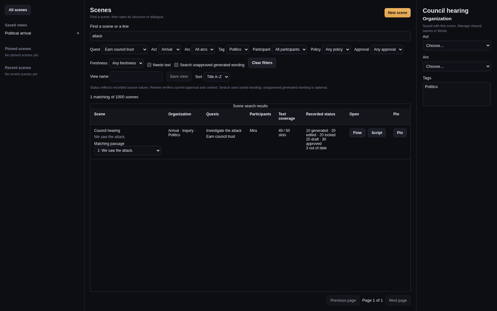
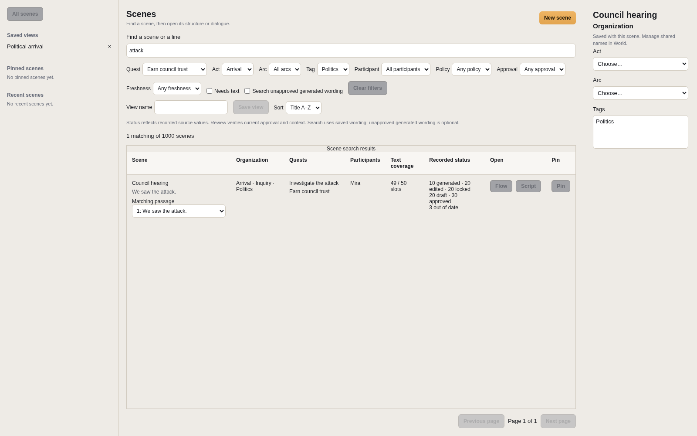

# Find and organize scenes

The Scene library reads bounded pages from the canonical-source index. Opening Narrative no longer needs every scene's dialogue in the renderer. The index is disposable: rebuilding it preserves search results, identities and source files.

Search matches scene names and summaries, beat titles and intent, required information, and saved dialogue. Each result includes at most five excerpts with stable scene/beat/slot/variant targets. Choose a matching passage, then open Flow or Script. Refine the search when a scene has more matches than the displayed excerpts. **Search unapproved generated wording** includes saved Generated-provenance text whose recorded review state is Draft; it does not search unsaved editor drafts or pending generation proposals.

Combine quest, act, arc, tag, participant, policy, approval, freshness and missing-text filters. Act, Arc and Tags have separate table columns. A scene in multiple quests appears once and lists each membership. Lifecycle facets describe the same variant. The status counts are recorded source values; Review still verifies current context and approval evidence. Field-level automatic freshness tracking remains separate work.

Create and rename Acts, Arcs and Tags in World. Their identities remain stable when names change. Scene organization selects one optional act, one optional arc and multiple tags; these changes join the same unsaved scene session used by Flow and Script, including local Undo and Redo. Use the scene's Save action to write them with its original conflict guard. Missing referenced classifications remain visible until repaired. Organization does not add runtime branches.

Saved views retain combined filters and sorting. Pins, recent scenes, selected result, page and scroll position are local to the project. Older saved views gain empty organization filters. Pages contain 25 scenes; pinned lookup reads at most eight pins and eight recent identities at once. Missing saved identities remain visible. If source changes between pages, the library requires **Restart results** rather than quietly mixing revisions. Malformed sources and duplicate scene identities appear in separately paged repair results, with bounded error messages.

If `narrative/world.yaml` is malformed or uses an unsupported schema version, discovery reports an error rather than guessing quest membership or organization. Scene Source repair does not repair World documents. Preserve a separate backup of the exact World file before correcting it in a text editor; retain stable record IDs and authored content, and use a compatible Wobu version for newer schemas. Do not delete the file or replace it with an empty World to clear the error. After correcting the file, choose **Restart results**.

## Evidence and limits

These screenshots show the earlier library checkpoint, before the combined Organization column was separated into Act, Arc and Tags. They use actual React components in Chromium with mocked Tauri IPC. They establish the displayed controls and states, not native timing. Native filesystem and Tauri/WebKit IPC measurements are recorded separately in [the scale evidence](evidence/narrative-194/README.md). The reproducible project has 1,000 scenes and 50,000 dialogue slots; the query benchmark is `wobu-store/examples/narrative_library_query.rs` and accepts an existing `.wobu` path.

The selected-read locator inventories current canonical file hashes before reading the selected file. Search checks scene content and World content before returning a revision. Same-mtime changes, deleted files and duplicate IDs therefore invalidate derived results without trusting watcher timing. This still reads the scene bytes to verify freshness; it avoids reparsing every scene on every selection. Cold index reconstruction is a separate, heavier operation. Query text is limited to 500 characters, pages to 100 records at the bridge (25 in the UI), lookup to 16 IDs, and excerpts to 180 source characters plus truncation marks.

No provider call is made by discovery or organization. N5 engine adapters remain excluded. Supporting-text asset authoring (#152/#167), automatic affected-generation tracking (#168), and full workspace/Flow acceptance are not implied by this library checkpoint.
