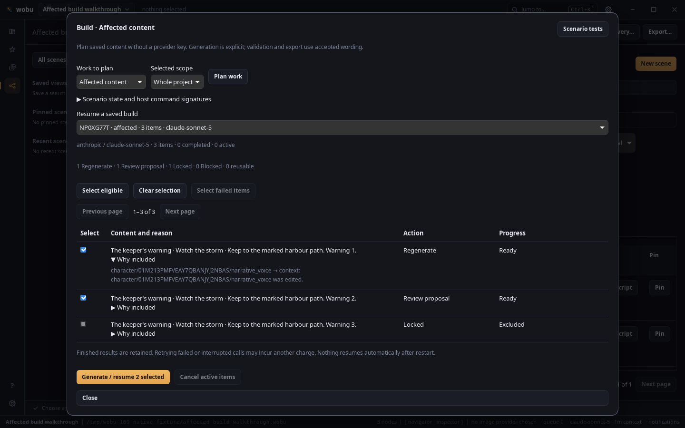
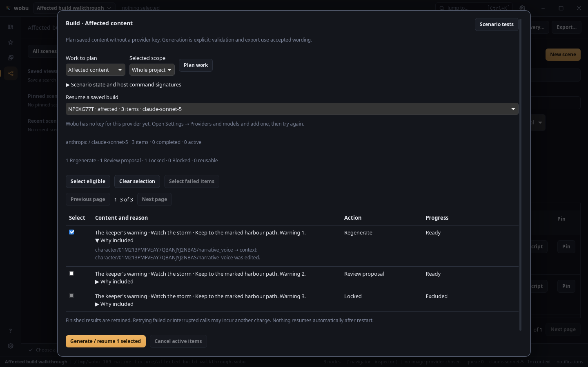
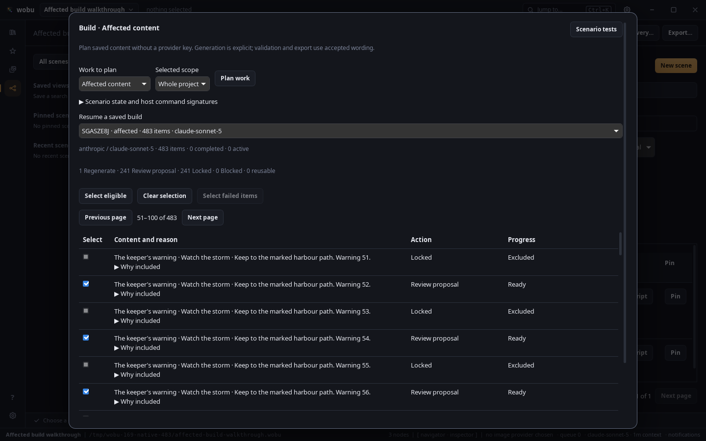
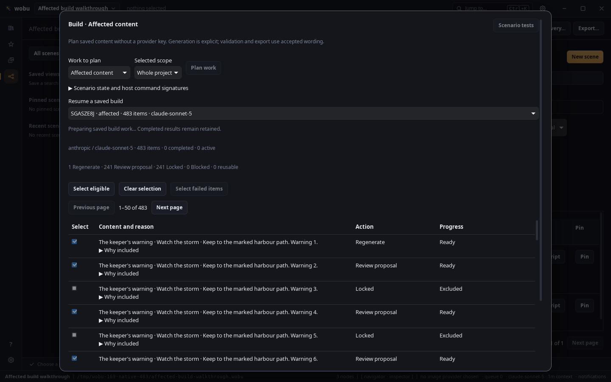
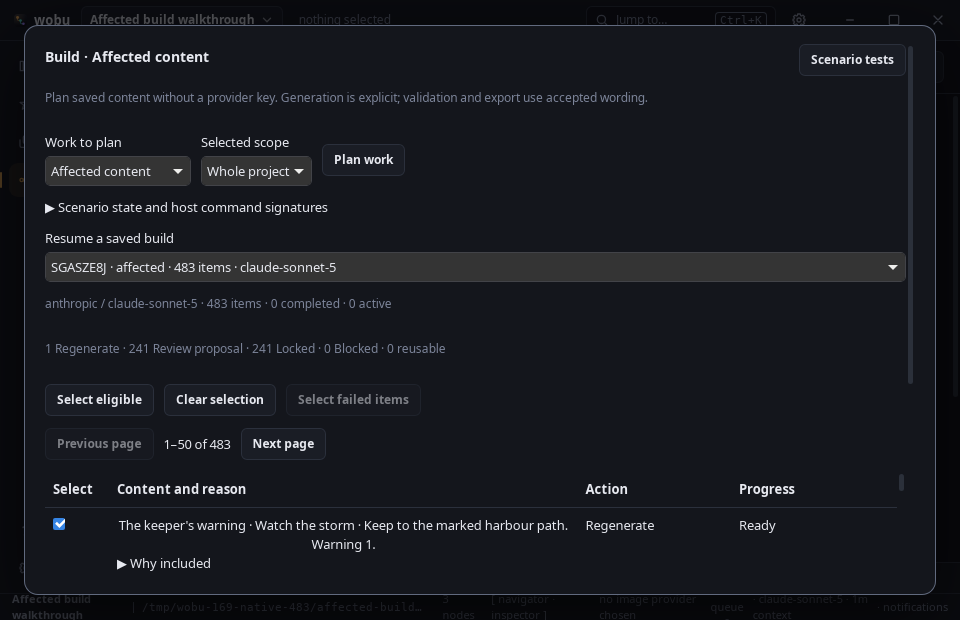
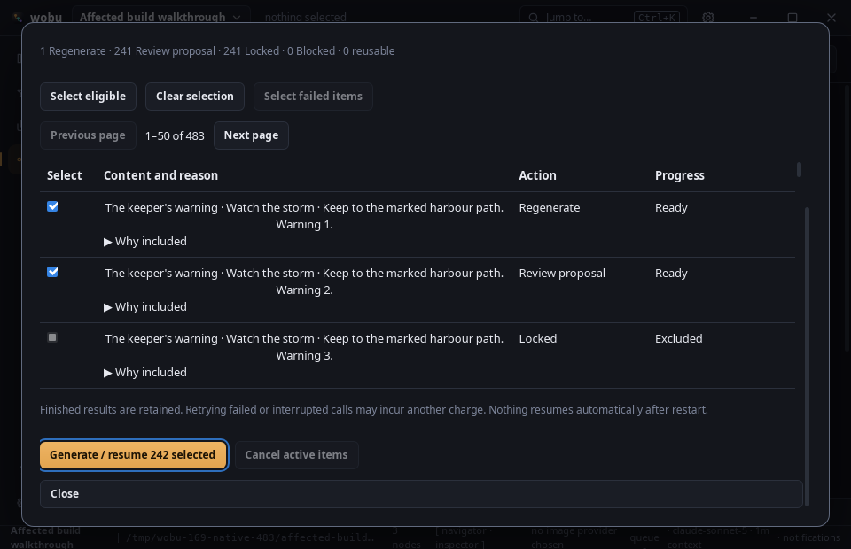

# Affected build native walkthrough

Captured on 8 September 2026 in a Linux Tauri 2 / WebKitGTK window, using integrated backend
`be14051` and frontend `772d4ed`. These are native application screenshots, not browser mocks.
The isolated development harness invoked registered commands, operated the actual UI and captured
window pixels. It temporarily dismissed its test onboarding store after loading; it did not accept
terms, change legal records, install credentials or contact a provider.

[Machine-readable results](results.json) record the fixtures, counts and window geometry.
The reproducible fixture generator is
[`affected_build_fixture.rs`](../../../src-tauri/crates/wobu-store/examples/affected_build_fixture.rs).
Run it against separate existing temporary parent directories with the default count and with `483`.
Each fixture records its original wording context and then changes the keeper's voice.

## Observed behavior

The small fixture planned three affected lines, showing one Generated replacement, one Edited
proposal and one Locked exclusion. The unrelated arrival sign remained outside the affected plan.
The expanded reason identifies the keeper's changed voice. Planning made no attempt or dispatch.

After deselecting the Edited row, the explicit one-item generation action reported the missing
provider key. Presence was checked beforehand: Anthropic had no key. No attempt, dispatch or job was
created. The saved plan remained available. Missing wording returned zero rows; All in selected
scope returned all four lines. Offline compilation produced a graph and left accepted YAML unchanged.

The larger fixture planned 483 affected lines: 1 Generated, 241 Edited and 241 Locked. The table
rendered 50 rows per page while counts and selection covered the complete plan. Page two displayed
rows 51–100. Locked rows remained disabled.

Closing and reopening the project retained the exact saved item identities. The 242 eligible request
histories still had zero attempts; there were no dispatches or queued jobs. Reopening did not generate
anything. The large fixture also compiled offline without modifying accepted source.

The modal remained inside the supported 960 × 620 minimum window. Its content scrolled internally;
focusing the complete-plan action brought it into view without spilling controls outside the
window. The window was restored to 1440 × 900 after capture.

## Verification boundary

The walkthrough found and fixed the outer modal sizing defect. Subsequent geometry checks and
screenshots verify the corrected layout. Script timing/selector assumptions were corrected to wait
for loaded controls and target pagination inside Build. Captured frontend error lists were empty.

These captures prove keyless planning, policy/reason presentation, explicit selection, missing-key
feedback, pagination, saved intent reopening and offline compilation. Successful generation,
partial failure/cancellation, output reuse, temporary-lock acceptance recovery, accepted-then-edited
completion and concurrent write guards are deterministic scripted-provider/real-file test evidence.
They are not claims of live-provider, Windows/macOS or game-engine validation. Large-project latency
remains separately tracked in #182; these screenshots are not a performance benchmark.
