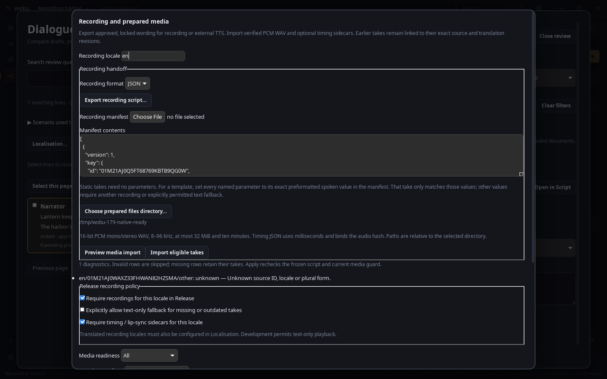
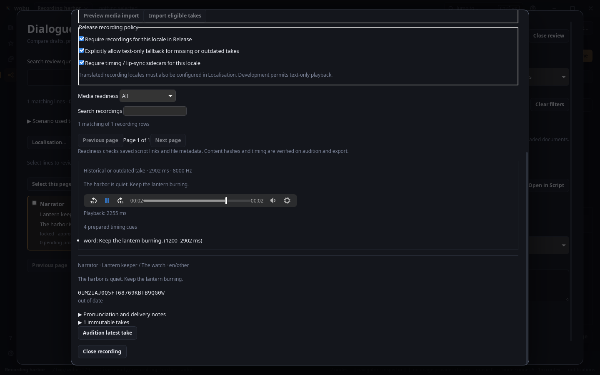
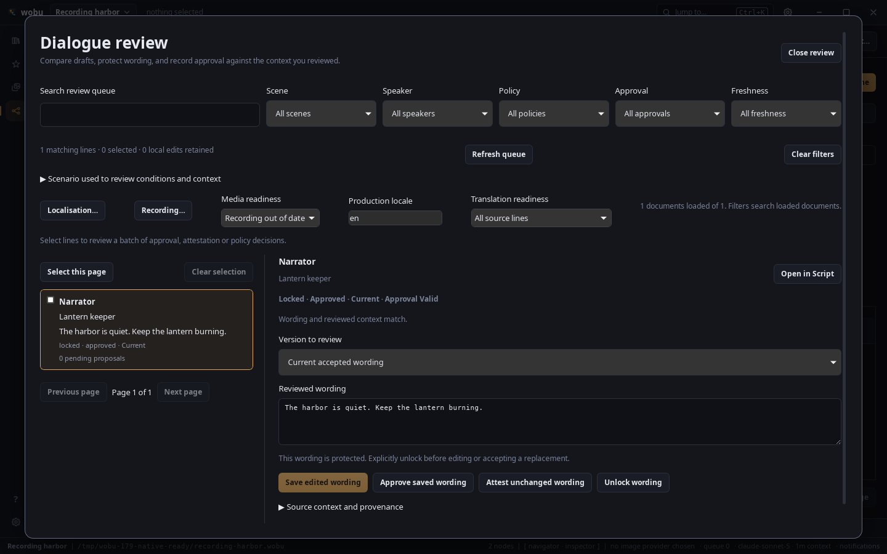
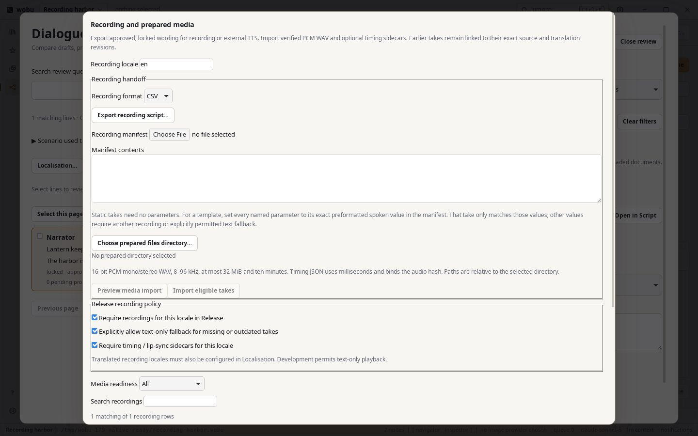
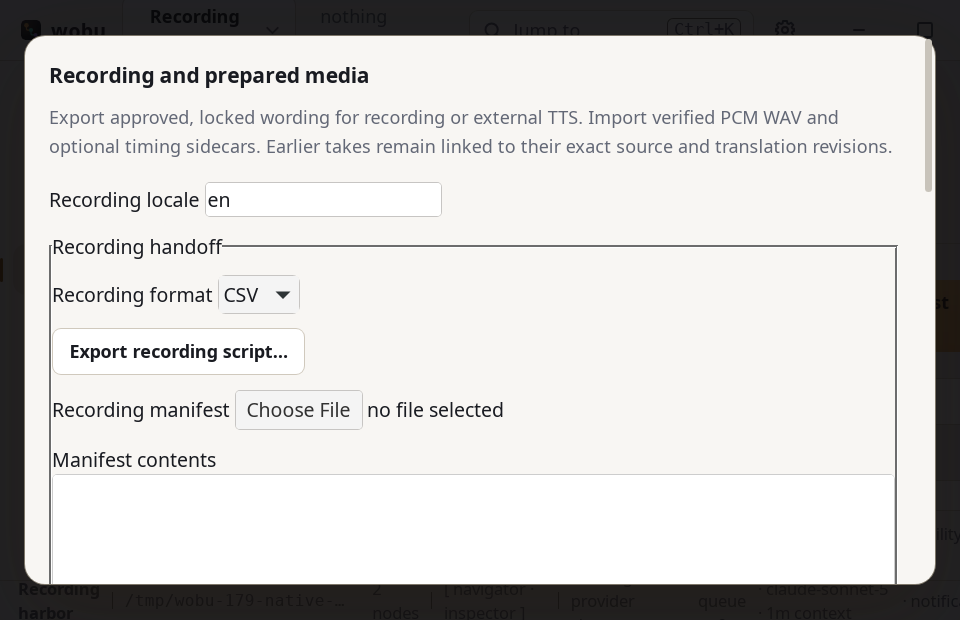

# Native recording and timing acceptance

Captured on 8 September 2026 in the Linux Tauri/WebKit desktop application. The real backend opened
`recording-harbor.wobu`, produced by the committed
[recording fixture](../../../examples/recording-handoff/README.md). Its original spoken line is
“The harbor is quiet. Keep the lantern burning.” The supplied offline WAV is PCM16 mono, 8 kHz,
46,482 bytes and 2.902375 seconds. Four hand-authored timing cues demonstrate word and viseme hooks;
this is not forced alignment or a live speech-provider result.

The walkthrough used actual Review/Recording controls and registered native commands. A temporary
read-only inspection helper captured element geometry, computed themes and the audio element's
playback clock; screenshots are native window captures. No agreement was recorded to bypass test
onboarding, and no provider job ran. Concurrent repository checks mean these observations are not
latency benchmarks.

## Verified sequence

1. The source started approved, current and locked. Requiring English audio **and timing**, with no
   fallback, blocked Release with `missing_media` and no payload hash.
2. Previewing a manifest containing one valid source and one unknown stable ID displayed the
   unknown-row diagnostic. Import applied only the valid take and retained one immutable history
   entry. SHA-256 hashes of canonical scene/text source files did not change.
3. Native Release export then succeeded with `prepared_media: 1`, one take, the exact WAV and timing
   sidecar. The exported package recorded 2,902 whole milliseconds and retained the stable string ID.
4. Actual Review **Unlock slot → Lock wording** retained the same wording revision but changed its
   protection-history guard. The original take became out of date and strict Release was blocked.
   Enabling the explicit text-only fallback checkbox produced a package with no take and exactly one
   fallback key; it did not relabel the old recording as current.
5. The historical take remained available for audition. Clicking the native audio play control
   advanced the real playback clock and displayed the active second-word and `ih` viseme cues.
   The player labels it historical/outdated, preserving the revision distinction during playback.
6. Review’s English media filter showed zero current recordings and one out-of-date recording.
   The source itself remained locked, approved and current; media readiness stayed independent.
7. Computed light/dark themes matched their screenshot labels. At 960 × 620 and 150% UI scale,
   the sheet remained within the window and its content scrolled vertically without horizontal
   overflow. The window was restored to 1440 × 900, scale 100%, dark theme afterward.

[Observations and native package metadata](observations.json) retain the exact release outcomes,
package hashes and minimum-window measurements.

## Screenshots

## Playback fix discovered by native verification

WebKit fetched the scoped `asset:` WAV successfully (200, `audio/x-wav`, correct bytes) but direct
media loading returned error 4. The same bytes decoded through installed GStreamer. A Blob probe
confirmed the custom-protocol boundary, and the final player fetches only the requested validated
take into a buffer bounded by its expected size and 32 MiB. It plays an `audio/wav` Blob URL with
`media-src blob:` allowed, aborts pending reads on replacement/close, pauses the old player and
revokes its URL. Focused tests cover late old-take bytes, cleanup and changed file size. The final
playback screenshot uses the product player and a real control click, not the probe override.

## Scope

Backend media/release checks used the integrated batch-3 implementation; the final playback pass
also included the native Blob player and pause cleanup. Rust package tests exercise exact parameter
lookup and native prepared audio/timing access. N5 Unity/Godot/Unreal adapters and cross-language
engine samples were explicitly excluded; no engine playback or alignment claim is made here.
